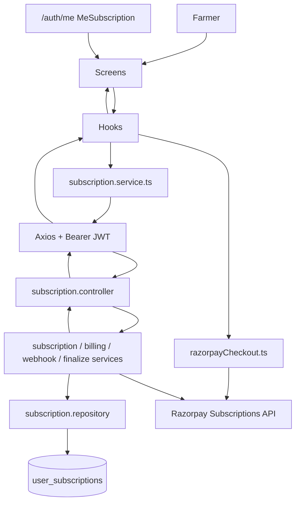
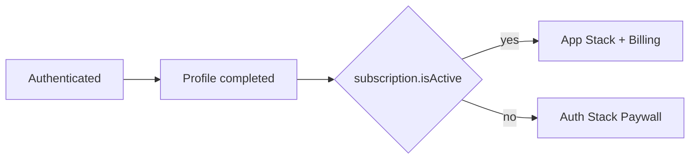

# Subscription & Billing Module

> **Scope:** Mobile Subscription paywall + in-app Billing hub + backend `/api/v1/subscription`  
> **Audience:** Engineers taking over production handover  
> **Source of truth:** Current repository implementation (August 2026)  
> **Related:** Auth `/auth/me` subscription fields; Razorpay Subscriptions (Dashboard plan); Gram Sahakari payment webhook **forwarding only** (not GS business logic)

---

## 1. MODULE OVERVIEW

| Field | Value |
|---|---|
| **Module Name** | Subscription & Billing |
| **Purpose** | Monetize mobile app access via Razorpay monthly subscriptions (₹100 / month) and let farmers view / cancel billing |
| **Business Goal** | Gate Home until paid; record charges; support cancel-at-cycle-end; reconcile with Razorpay |
| **User Goal** | Pay once via Checkout, enter the app, see membership status and payment history, cancel renewals if needed |
| **Primary Features** | Create subscription, Checkout auth, verify signature, webhook sync, refresh, cancel, billing history/detail, 15‑min reconciliation |
| **High-Level Summary** | Backend owns Razorpay Subscriptions + Mongo `user_subscriptions`. Mobile has (1) auth-stack **paywall**, (2) Profile → **सदस्यत्व** billing UI, (3) payment detail. ADMIN/TEAM bypass paywall via `/auth/me`. |

**Explicitly not this module:** Gram Sahakari ₹500 registration Orders, Community, Marketplace, Crop, Weather. Auth is a **dependency** only (`authenticate`, `refreshUser`, `MeSubscription`).

---

## 2. SCREENS

### 2.1 Subscription Screen (Paywall)

| Aspect | Implementation |
|---|---|
| **Purpose** | Collect first payment so `subscription.isActive` becomes true |
| **Route** | `/(auth)/subscription` → `app/(auth)/subscription.tsx` → `SubscriptionScreen` |
| **Navigation path** | Splash / OTP / Complete Profile → paywall when authenticated + profile complete + `!subscription.isActive` |
| **Entry points** | Splash redirect; OTP success when inactive; Complete Profile → `router.replace('/(auth)/subscription')` |
| **Exit points** | No `router` success navigate — `refreshUser()` flips root `canEnterApp` → App Stack |
| **User flow** | Pay Now → create → Razorpay Checkout → verify → refresh user → Home |
| **When it appears** | Inside `(auth)` when `!canEnterApp` and user lands on subscription route |
| **Navigates to** | Implicit Home (tabs) via guard; not an explicit push |
| **Dependencies** | `useSubscriptionPayment`, `useAuth`, `subscription.strings`, `SUBSCRIPTION_FEE_RUPEES`, `react-native-razorpay` (native) |

### 2.2 Subscription & Billing Screen

| Aspect | Implementation |
|---|---|
| **Purpose** | Show current membership, history, cancel / renew actions |
| **Route** | `/subscription-billing` → `SubscriptionBillingScreen` |
| **Navigation path** | Profile tab → outlined button → push |
| **Entry points** | `ProfileScreen` → `router.push('/subscription-billing')` |
| **Exit points** | History → `/subscription-billing/[paymentId]`; Renew → `/(auth)/subscription`; stack back |
| **User flow** | Load current + history → scan hero → open payment → cancel dialog or renew |
| **When it appears** | Only when `canEnterApp` (authenticated + profile + active subscription) — screen is inside protected App Stack |
| **Dependencies** | `useSubscriptionBilling`, `BillingCards`, `billing.strings`, OrganicBackground |

### 2.3 Billing Detail Screen

| Aspect | Implementation |
|---|---|
| **Purpose** | Technical payment fields + copy IDs |
| **Route** | `/subscription-billing/[paymentId]` → `BillingDetailScreen` |
| **Entry** | History row tap |
| **Exit** | Stack back |
| **User flow** | Fetch detail by `paymentId` → view / copy |
| **Dependencies** | `getBillingPaymentDetail`, `billing.strings`, `billing.utils`, `expo-clipboard` |

### Screens that do **not** exist

| Screen | Status |
|---|---|
| Resume subscription UI | **Not implemented** (backend `POST /resume` exists) |
| Refund request UI | **Not implemented** (backend always **501**) |
| Admin subscription console | **Not implemented** |
| Web Checkout | **Not implemented** — SDK throws on `Platform.OS === 'web'` |

---

## 3. FOLDER STRUCTURE

### Mobile — `Mobile App/src/features/subscription/`

```
features/subscription/
├── screens/
│   ├── SubscriptionScreen.tsx          # Paywall UI
│   ├── SubscriptionBillingScreen.tsx   # Billing hub
│   └── BillingDetailScreen.tsx         # Payment detail
├── components/
│   └── BillingCards.tsx                # Hero, history, refund policy, support, action bar
├── hooks/
│   ├── useSubscriptionPayment.ts       # Paywall payment orchestration
│   └── useSubscriptionBilling.ts       # Current + history + cancel (+ unused syncFromGateway)
├── lib/
│   └── razorpayCheckout.ts             # Native Razorpay.open(subscription_id)
├── subscription.service.ts             # HTTP client
├── subscription.types.ts               # DTOs / PaymentPhase
├── subscription.constants.ts           # Fee, brand color, period label
├── subscription.strings.ts             # English paywall copy
├── billing.strings.ts                  # Marathi billing copy
└── billing.utils.ts                    # Formatters + status chips
```

**App routes**

| File | Responsibility |
|---|---|
| `app/(auth)/subscription.tsx` | Re-export paywall |
| `app/subscription-billing.tsx` | Re-export billing hub |
| `app/subscription-billing/[paymentId].tsx` | Re-export detail |
| `app/_layout.tsx` | `canEnterApp` guard + stack titles `सदस्यत्व` / `पेमेंट तपशील` |
| `app/(auth)/_layout.tsx` | Registers `subscription` screen, `headerShown: false` |

**Theme / assets:** Uses shared `@/theme` (`OrganicBackground`, Paper theme). No subscription-specific image assets. Brand Checkout color: `SUBSCRIPTION_BRAND_COLOR = '#1B5E3B'`.

### Backend — `Backend/backend/src/modules/subscription/`

```
modules/subscription/
├── routes/index.ts
├── controller/subscription.controller.ts
├── service/
│   ├── subscription.service.ts         # create/verify/cancel/resume/refresh/current/status
│   ├── razorpay-subscription.service.ts
│   ├── finalize.service.ts             # applyGatewaySnapshot + billing upsert
│   ├── webhook.service.ts
│   ├── reconciliation.service.ts
│   ├── billing.service.ts
│   ├── refund.service.ts               # always 501
│   └── audit.service.ts
├── repository/subscription.repository.ts
├── dto/subscription.dto.ts
├── validation/subscription.validation.ts
├── interfaces/subscription.interface.ts
├── types/subscription.types.ts
├── utils/access.ts
├── middlewares/requireActiveSubscription.ts   # NOT mounted on any route
├── subscription.model.ts
├── subscription.constants.ts
└── subscription.scheduler.ts
```

**Mount:** `routes/index.ts` → `router.use("/api/v1/subscription", subscriptionRoutes)`.  
**Startup:** `server.ts` → `startSubscriptionReconciliationScheduler()`.  
**Related (outside module):** payment module signature helpers; GS payment webhook forwards `subscription.*` events.

---

## 4. ARCHITECTURE



### Layer responsibilities

| Layer | Role |
|---|---|
| **Screen** | Layout, dialogs, navigation params |
| **Hook** | Loading/error/phase; call services; `refreshUser` |
| **Mobile service** | DTO ↔ HTTP only |
| **Checkout lib** | Native SDK; returns verify body |
| **Controller** | Auth, Zod, map to HTTP status |
| **Business service** | Ownership, Razorpay calls, access rules |
| **Finalize** | Single writer for gateway → Mongo + billingPayments |
| **Repository** | Mongoose queries / upserts |
| **MongoDB** | Source of truth for local subscription state |
| **Razorpay** | Source of truth for gateway subscription / charges |
| **Scheduler** | Periodic fetch + apply snapshot |

There is **no Zustand** store for subscription. AuthContext holds `user.subscription` from `/auth/me`.

---

## 5. COMPONENT ARCHITECTURE

All major billing UI components live in `BillingCards.tsx`.

### `SubscriptionHeroCard`

| | |
|---|---|
| **Purpose** | Single premium status summary (no duplicate plan card) |
| **Props** | `{ subscription: SubscriptionDTO }` |
| **Responsibilities** | Status chip, amount/month, next payment, period pill, method, auto-renew meta |
| **Reusable** | Yes within feature |
| **Parent** | `SubscriptionBillingScreen` |
| **Children** | `FadeIn`, `StatusChip` |

### `BillingHistoryCard`

| | |
|---|---|
| **Purpose** | Compact payment list |
| **Props** | `{ items: BillingPaymentDTO[]; onPressItem(paymentId: string) }` |
| **Responsibilities** | Empty state; row = status, amount, date, method, chevron — **no long IDs** |
| **Parent** | `SubscriptionBillingScreen` |

### `RefundPolicyCard`

| | |
|---|---|
| **Purpose** | Static Marathi info rows (not an API) |
| **Props** | none |
| **Parent** | `SubscriptionBillingScreen` |

### `SupportCard`

| | |
|---|---|
| **Purpose** | FAQ / Contact tiles |
| **Props** | `{ onFaq, onContact }` |
| **Note** | Callers show `Alert` with `comingSoon` — **not wired** to real support |

### `BillingActionBar`

| | |
|---|---|
| **Purpose** | Fixed bottom Renew / Cancel |
| **Props** | `showRenew`, `showCancel`, `cancelling`, `onRenew`, `onCancel` |
| **Parent** | `SubscriptionBillingScreen` |

### Paywall components

`SubscriptionScreen` uses React Native Paper `Surface` / `Button` / `ActivityIndicator` inline — **no** shared BillingCards.

### Detail locals

`BillingDetailScreen` defines local `DetailRow` / `CopyRow` (not in `BillingCards.tsx`).

---

## 6. STATE MANAGEMENT

| Kind | Where | Why |
|---|---|---|
| **Local React state** | Screens + hooks | Feature-scoped; no global billing store |
| **Auth Context** | `useAuth().user.subscription` | Gate `canEnterApp`; refreshed after pay/cancel |
| **Zustand** | **Not used** for this module | — |
| **Refs** | `inFlightRef` in `useSubscriptionPayment` | Prevent double Pay Now |
| **Derived** | `showRenew`, `showCancel`, `busy`, chip tones | From DTO fields |
| **AppState listener** | `useSubscriptionBilling` | Soft reload when app foregrounds |
| **Client persistence** | **None** (no SecureStore for billing) | Always fetch from API |

`syncFromGateway` is implemented in the billing hook but **never called** by any screen (technical debt).

---

## 7. API DOCUMENTATION

Base: **`/api/v1/subscription`**  
Success envelope: `{ success: true, data: T }`  
Error envelope: `{ success: false, message: string }`

**Rate limits:** None specific to this module in code.  
**HTTP caching:** None.  
**Classification legend:** Mobile = used by app · Internal = available · Scheduler = background · Admin = none

---

### 7.1 `POST /api/v1/subscription/create`

| Field | Value |
|---|---|
| **Purpose** | Create or reuse Razorpay subscription for Checkout |
| **Auth** | Bearer JWT (`authenticate`) |
| **Authorization** | Any authenticated user; no ADMIN bypass on this route |
| **Request** | Empty body |
| **Response** | `CreateSubscriptionResponseDTO` — **201** |
| **Validation** | Plan env required |
| **Errors** | **401** missing user; **409** already active access; **503** plan not configured; **502** Razorpay |
| **Retry** | Client may retry; server reuses `CREATED` living sub |
| **Classification** | **Mobile** |
| **Business notes** | Amount `10000` paise; `total_count` 120; notes `purpose: APP_SUBSCRIPTION` |

---

### 7.2 `GET /api/v1/subscription/current`

| Field | Value |
|---|---|
| **Purpose** | Latest subscription DTO for billing UI |
| **Auth** | Required |
| **Response** | `SubscriptionDTO \| null` — **200** |
| **Classification** | **Mobile** |

---

### 7.3 `GET /api/v1/subscription/status`

| Field | Value |
|---|---|
| **Purpose** | Lightweight access check (paywall / confirm) |
| **Auth** | Required |
| **Response** | `SubscriptionStatusDTO` — **200** |
| **Classification** | **Mobile** |

---

### 7.4 `POST /api/v1/subscription/verify`

| Field | Value |
|---|---|
| **Purpose** | Verify Checkout signature and activate local state |
| **Auth** | Required |
| **Request** | `{ razorpay_payment_id, razorpay_subscription_id, razorpay_signature }` |
| **Validation** | Zod `verifySubscriptionSchema` `.strict()` |
| **Response** | `VerifySubscriptionResponseDTO` — **200** |
| **Errors** | **400** zod/signature; **403** wrong owner; **404** not found; **503** secret missing |
| **Idempotency** | Event claim `sub_verify_{subId}_{paymentId}` |
| **Classification** | **Mobile** |

---

### 7.5 `POST /api/v1/subscription/cancel`

| Field | Value |
|---|---|
| **Purpose** | Cancel on Razorpay; default at cycle end |
| **Auth** | Required |
| **Request** | `{ cancelAtCycleEnd?: boolean }` — default **true** if omitted / not `false` |
| **Validation** | Zod `cancelSubscriptionSchema` |
| **Response** | `SubscriptionDTO` — **200** |
| **Errors** | **404** no living sub; **502** gateway |
| **Classification** | **Mobile** (always sends `cancelAtCycleEnd: true` today) |

---

### 7.6 `POST /api/v1/subscription/resume`

| Field | Value |
|---|---|
| **Purpose** | Resume a **PAUSED** Razorpay subscription |
| **Auth** | Required |
| **Request** | none |
| **Response** | `SubscriptionDTO` — **200** |
| **Errors** | **404**; **409** if not `PAUSED`; **502** |
| **Classification** | **Internal** — **not called by mobile** |

---

### 7.7 `POST /api/v1/subscription/refresh`

| Field | Value |
|---|---|
| **Purpose** | Fetch Razorpay + `applyGatewaySnapshot` |
| **Auth** | Required |
| **Response** | `SubscriptionDTO` — **200** |
| **Classification** | **Mobile** (after verify; also unused UI sync path) |

---

### 7.8 `GET /api/v1/subscription/billing/history`

| Field | Value |
|---|---|
| **Purpose** | List billing payments for current user |
| **Auth** | Required |
| **Response** | `BillingPaymentDTO[]` — **200** (empty array if no doc) |
| **Business notes** | Prefer `billingPayments[]`; else legacy from events / `latestPaymentId` |
| **Classification** | **Mobile** |

---

### 7.9 `GET /api/v1/subscription/billing/history/:paymentId`

| Field | Value |
|---|---|
| **Purpose** | Single payment detail |
| **Auth** | Required |
| **Errors** | **400** empty id; **404** missing |
| **Classification** | **Mobile** |

---

### 7.10 `POST /api/v1/subscription/webhook`

| Field | Value |
|---|---|
| **Purpose** | Razorpay subscription webhooks |
| **Auth** | **Public** — HMAC `X-Razorpay-Signature` + event id |
| **Response** | `{ received: true, status: "ok"\|"ignored"\|"duplicate"\|"rejected" }` |
| **Errors** | **400** invalid signature → `rejected` |
| **Classification** | **Internal** (Razorpay) |

**Also:** `POST /api/v1/gram-sahakari/application/payment/webhook` forwards events whose name starts with `subscription.` to the same handler (Dashboard single-URL support). GS payment logic itself is out of scope.

---

### 7.11 `POST /api/v1/subscription/refund`

| Field | Value |
|---|---|
| **Purpose** | Placeholder |
| **Auth** | Required |
| **Response** | Always **501** |
| **Classification** | **Internal** — **not used by mobile** |

---

### Dependency API (Auth — not subscription module)

| Method | Endpoint | Role |
|---|---|---|
| `GET` | `/api/v1/auth/me` | Returns `user.subscription: MeSubscription`; ADMIN/TEAM forced `isActive: true` |
| OTP verify | auth module | Same `subscription` shape on login |

---

## 8. DTO DOCUMENTATION

### `SubscriptionDTO`

| Field | Required | Notes |
|---|---|---|
| `id`, `userId`, `planId` | yes | Mongo + Dashboard plan |
| `planName` | yes | Constant `"Kisan Katta Monthly"` |
| `billingFrequency` | yes | `"Every 1 Month"` |
| `subscriptionId`, `customerId` | nullable | Razorpay ids |
| `status` | yes | Local enum |
| `isActive` | yes | From `hasSubscriptionAccess` |
| `autoRenewalEnabled` | yes | Access + ACTIVE/AUTHENTICATED + not cancel flags |
| `amount` | yes | Paise |
| `amountRupees` | yes | `amount/100` |
| `currency`, `quantity`, `totalCount`, `paidCount` | yes | |
| Period / next charge / method / latestPaymentId / cancelledAt | nullable as typed | ISO strings in JSON |
| `cancelAtCycleEnd` | yes | boolean |
| `createdAt`, `updatedAt` | yes | ISO |

### `CreateSubscriptionResponseDTO`

`subscriptionId`, `planId`, `status`, `amount`, `currency`, `key` (public), `shortUrl`.

### `VerifySubscriptionResponseDTO`

`{ subscription: SubscriptionDTO, paymentId: string }`.

### `SubscriptionStatusDTO` / `MeSubscription`

`isActive`, `status`, `currentPeriodEnd`, `subscriptionId` (Me uses `string \| null` status).

### `BillingPaymentDTO`

`paymentId`, `invoiceId`, `amount`, `amountRupees`, `currency`, `status` (`PAID|FAILED|PENDING|REFUNDED`), `paymentMethod`, `paidAt`, `periodStart`, `periodEnd`, `gateway`, `subscriptionId`.

### Request bodies

- **Verify:** three Razorpay strings (required).  
- **Cancel:** optional `cancelAtCycleEnd`.  

### Relationships

`BillingPaymentDTO.subscriptionId` → Razorpay subscription id string (not Mongo `_id`).  
`SubscriptionDTO.id` → Mongo `_id`.  
One user → many historical docs possible; APIs use **latest** by `updatedAt`.

---

## 9. BACKEND INTEGRATION

### Routes & middleware

All authenticated routes use `authenticate` except `/webhook`.  
`requireActiveSubscription` middleware exists (**402** if inactive; ADMIN/TEAM skip) but is **not mounted** on any route — mobile uses root layout guard instead.

### Controllers

Handlers in `subscription.controller.ts` map to create, current, status, verify, cancel, resume, refresh, webhook, refund, billing history/detail.

### Services

| Service | Role |
|---|---|
| `subscription.service` | User-facing lifecycle |
| `razorpay-subscription.service` | SDK: create/fetch/cancel/resume |
| `finalize.service` | `applyGatewaySnapshot` + billing upsert |
| `webhook.service` | Signature, claim, apply |
| `reconciliation.service` | Batch refresh candidates |
| `billing.service` | History/detail reads |
| `refund.service` | 501 |
| `audit.service` | Structured console audit logs |

### Repository

`subscription.repository.ts`: `findLatestByUserId`, `findBySubscriptionId`, `findLivingByUserId`, `createSubscriptionDoc`, transitions/updates, `upsertBillingPayment`, `findReconcileCandidates`.

### Validation

Zod verify + cancel only. Refund body is loosely read then rejected with 501.

### Schedulers

`subscription.scheduler.ts`: interval **15** minutes, batch **100**, also runs on startup; skipped in `test` or when Razorpay env incomplete; `unref()` on interval.

### Locks / transactions

- Webhook/verify **event claim** for idempotency (shared payment events ledger pattern).  
- No multi-document Mongo transaction specific to subscription create.  
- Unique partial index on `subscriptionId` when string.

### Caching

No Redis/in-memory cache layer in this module.

---

## 10. DATABASE

### Collection: `user_subscriptions`

**Model:** `UserSubscription` (`strict: true`, timestamps).

**Indexes**

1. `userId: 1`  
2. `status: 1`  
3. Unique partial `subscriptionId: 1` where type string  
4. `{ userId: 1, status: 1, updatedAt: -1 }`

**Read paths:** latest by user; by Razorpay subscription id; living statuses; reconcile candidates; billing array / legacy derivation.

**Write paths:** create; transition/update; append events; upsert `billingPayments`; cancel flags.

**Aggregation:** Not used for billing list — array on document (+ legacy fallback in service).

**Transactions:** Not used for subscription writes (event claim is separate).

**Source of truth:** Local doc for app gating; Razorpay for gateway truth; finalize merges gateway → local.

**Caching:** None.

**Related collections (dependency):** Auth users; `razorpay_events` (or equivalent) for webhook/verify idempotency — owned by payment infrastructure, not redefined here.

---

## 11. DATA FLOW

### Subscription purchase

```
User taps Pay Now
  → useSubscriptionPayment.payNow
  → POST /create
  → openSubscriptionCheckout(subscription_id)
  → Razorpay UI
  → POST /verify (signature)
  → applyGatewaySnapshot (VERIFY)
  → POST /refresh (best-effort)
  → refreshUser() → GET /auth/me
  → canEnterApp true → Home
```

Parallel: Razorpay may send `subscription.authenticated` / `activated` / `charged` webhooks → same finalize path.

### Payment verification

```
Checkout success payload
  → validatePaymentVerification(payment_id|subscription_id)
  → ownership check
  → claimEvent
  → fetch Razorpay subscription (+ payment method best-effort)
  → applyGatewaySnapshot
  → upsert billing PAID when event type qualifies
```

### Billing history

```
Billing screen mount
  → parallel GET /current + GET /billing/history
  → map billingPayments (or legacy)
  → BillingHistoryCard
  → tap → GET /billing/history/:paymentId
```

### Cancel

```
Dialog confirm
  → POST /cancel { cancelAtCycleEnd: true }
  → Razorpay cancel_at_cycle_end
  → update local flags
  → refreshUser
  → access may remain until currentPeriodEnd
```

### Refresh / recon

```
Client: POST /refresh
Scheduler: every 15m fetch candidates → Razorpay fetch → applyGatewaySnapshot (RECONCILIATION)
```

### Webhook update

```
POST /webhook (or GS payment webhook forward)
  → HMAC verify
  → claim event
  → ignore unsupported / unknown sub
  → prefer live fetch
  → applyGatewaySnapshot (WEBHOOK)
```

---

## 12. BUSINESS RULES

| # | Rule |
|---|---|
| 1 | Fee **₹100** (`10000` paise); currency **INR** |
| 2 | Plan from env `RAZORPAY_SUBSCRIPTION_PLAN_ID` — never create plans via API |
| 3 | `total_count` **120**, quantity **1** |
| 4 | Notes `purpose = APP_SUBSCRIPTION` |
| 5 | Access: ACTIVE/AUTHENTICATED always; CANCELLED/COMPLETED/PAUSED/PENDING/HALTED only if `currentPeriodEnd > now`; CREATED/EXPIRED/null → no access |
| 6 | ADMIN/TEAM: `/auth/me` forces `isActive: true` (paywall bypass) |
| 7 | Cannot create if living sub already has access → **409** |
| 8 | Reuse living `CREATED` with subscriptionId on create (idempotent Checkout) |
| 9 | Verify signature = HMAC of `payment_id\|subscription_id` with key secret |
| 10 | Cancel default **at cycle end** |
| 11 | Resume only from local status **PAUSED** |
| 12 | `autoRenewalEnabled` false if cancelled / cancelAtCycleEnd / no access / not ACTIVE|AUTHENTICATED |
| 13 | Billing upsert as **PAID** only for verify success + webhook authenticated/activated/charged |
| 14 | Refund always **501** |
| 15 | Mobile cancel UI only if `isActive && autoRenewalEnabled && status !== 'CANCELLED'` |
| 16 | Mobile renew UI only if subscription exists and `!isActive` |
| 17 | App stack billing routes require active subscription gate |

---

## 13. SCREEN STATES

### Paywall (`SubscriptionScreen`)

| State | Behaviour |
|---|---|
| idle | Pay Now enabled |
| creating / checkout / verifying / refreshing | Spinner + English loading label |
| failed | Error text + Retry |
| success | Success UI; guard navigates away |
| Already active on mount | `confirmActive` + `refreshUser` |

### Billing hub

| State | Behaviour |
|---|---|
| Loading | Large spinner |
| Refreshing | Pull-to-refresh |
| Error empty | Message + Retry |
| No subscription | Copy + Renew |
| Success | Hero + history + policies + actions |
| Cancelling | Dialog buttons disabled / loading |
| Snack | Cancel success Marathi |

### Detail

| State | Behaviour |
|---|---|
| Loading | Spinner |
| Error | Message + Retry |
| Success | Hero + copy rows + receipt placeholder |

### Status chips (billing utils)

Green success · Orange warning · Red danger · Gray neutral — mapped from subscription/payment status.

**Offline:** No dedicated offline queue — network errors surface as generic load/pay failures.

---

## 14. USER FLOWS

### A. First subscription

```
Login → OTP → Complete Profile → Paywall → Pay → Checkout → Verify → Home
```

### B. Billing history

```
Home → Profile → सदस्यत्व → history row → पेमेंट तपशील → back
```

### C. Cancel

```
Billing → Cancel → confirm → API cancelAtCycleEnd → snack → still in app until period ends (if access rule allows)
```

### D. Renew after expiry

```
Billing (inactive) or Splash → Paywall → same purchase flow
```

### E. Webhook-first activation

```
Pay → user kills app before verify → webhook activates → next open confirmActive /auth/me → Home
```

---

## 15. PERFORMANCE

| Topic | Reality |
|---|---|
| **Caching** | None client-side for subscription docs |
| **Memoization** | Minimal (billing cards use Animated; no heavy lists) |
| **Lazy loading** | Route-level code splitting via Expo Router only |
| **Background refresh** | AppState soft reload; 15‑min server recon |
| **Expected API count — billing open** | **2** (`/current` + `/history`) |
| **Expected API count — pay success** | create + verify + refresh + `/auth/me` (+ optional status polls) |
| **Detail** | **1** extra GET (does not reuse list item alone) |
| **Bottlenecks** | Double fetch current+history same Mongo doc; foreground reload every AppState active; debug `console.log` in payment path |

---

## 16. SECURITY

| Concern | Implementation |
|---|---|
| **Authentication** | JWT on all user routes |
| **Authorization** | Verify/cancel/refresh scoped to caller's subscription ownership |
| **Checkout signature** | `payment_id\|subscription_id` HMAC with key secret |
| **Webhook** | Webhook secret HMAC on raw body |
| **Input validation** | Zod strict verify/cancel |
| **Ownership** | Subscription must belong to `userId` |
| **Sensitive data** | Public key only on client; secrets server-side |
| **Duplicate prevention** | Event claims; create reuse for CREATED |
| **Abuse** | Active sub blocks new create (409) |
| **ADMIN bypass** | Only via `/auth/me` isActive — not a free create on farmer APIs |

---

## 17. FAILURE MATRIX

| Failure | Behaviour | Recovery |
|---|---|---|
| Network on create/verify | Phase `failed` + message | Retry |
| User cancels Checkout | Codes `0`/`2` → failed, often empty error | Pay again |
| Verify fails but webhook activated | Client polls `/status`; may still succeed | refreshUser |
| Invalid signature | 400 | Do not invent success |
| Already active create | 409 | Show error; use existing access |
| Cancel gateway fail | 502 | Keep local until retry |
| History empty | `[]` | Empty UI |
| Payment detail missing | 404 | Error + retry |
| Offline | Axios error | Retry when online |
| Refund call | 501 | UI does not call |
| Recon failure | Audit log; next interval | Automatic |
| Web missing Razorpay | Throw | Use native build |

---

## 18. ERROR HANDLING

| Layer | Behaviour |
|---|---|
| **Frontend** | `getErrorMessage`; snackbars/Alerts; paywall inline error; billing retry buttons |
| **Backend** | `AppError` + asyncHandler → `{ success: false, message }` |
| **User messages** | Paywall English; billing Marathi (`loadError`, `cancelError`, etc.) |
| **Recovery** | Retry, pull-to-refresh, remount confirmActive |

---

## 19. PRODUCTION DECISIONS

| Decision | Why |
|---|---|
| Razorpay **Subscriptions** (not Orders) | Recurring ₹100/month with Dashboard plan |
| Separate from GS ₹500 Orders | Different product, amount, purpose note |
| Dual verify + webhook | Client may die after Checkout; webhook is safety net |
| `hasSubscriptionAccess` period grace | Cancel stops renewals but paid period remains usable |
| Finalize single writer | Avoid divergent verify/webhook/recon update logic |
| Billing embedded array | Simple per-user history without separate collection |
| 15‑min recon | Heal missed webhooks |
| Mobile Marathi billing / English paywall | Current product choice (not i18n framework) |
| Refund 501 | Explicit placeholder until policy/ops ready |
| Guard in root layout | Keep Home unreachable without server-backed `isActive` |

---

## 20. PRODUCTION READINESS

| Area | Score (/10) | Justification |
|---|---|---|
| Backend | **8.5** | Full lifecycle + webhook + recon + repository |
| Frontend | **8.0** | Paywall + Marathi billing; resume/refund unused; syncFromGateway dead |
| API | **8.5** | Clear routes; resume/refund incomplete product-wise |
| MongoDB | **8.5** | Indexes + partial unique subscriptionId |
| Security | **9.0** | Signatures + ownership + auth |
| Performance | **7.0** | Extra fetches; AppState reload; detail refetch |
| Maintainability | **8.0** | Clear module layout; debug logs still present |
| Scalability | **7.5** | Embedded billing OK for farmers; recon batch 100 |
| Testing | **6.5** | Scripts/investigation exist historically; no full automated suite documented in-module |
| **Overall** | **8.1** | |

**Launch blockers:** None for core pay → access → billing view/cancel, if env keys + Dashboard plan + webhook URL configured and **native** Razorpay build used.

**Known limitations**

1. Refund not implemented (501)  
2. Resume API without mobile UI  
3. `requireActiveSubscription` unused  
4. `syncFromGateway` unused by UI  
5. Billing upsert path writes **PAID** only for select events  
6. Renew navigates to `/(auth)/subscription` from protected stack (works via guards but is awkward)  
7. Payment debug `console.log` still in client  

**Technical debt:** Dual EN/MR copy; unused string keys; OPEN_CHECKOUT_STATUSES unused constant.

---

## 21. PERFORMANCE METRICS

| Metric | Expectation |
|---|---|
| Billing screen API count | 2 parallel |
| Pay success critical path | ≥4 round trips (+ Razorpay UI) |
| Render | Light; Animated fade-ins ≤320ms on cards |
| Refresh frequency | Pull manual; AppState on foreground; server 15 min |
| Critical ops | create, verify, webhook finalize |
| Slow ops | Razorpay network; Checkout UX |

Memory: negligible (no large caches).

---

## 22. TESTING CHECKLIST

### Manual QA

- [ ] New user: profile → paywall → pay → lands Home  
- [ ] Kill app after Checkout before verify → webhook/recon → next launch Home  
- [ ] ADMIN/TEAM skips paywall via `/auth/me`  
- [ ] Profile → सदस्यत्व shows hero once (no duplicate plan card)  
- [ ] History opens detail; copy IDs  
- [ ] Cancel → snack; autoRenew off; access until period end  
- [ ] Inactive → Renew → paywall  

### Regression

- [ ] GS ₹500 registration payments unaffected  
- [ ] Webhook forward still routes `subscription.*`  

### API

- [ ] create idempotent CREATED reuse  
- [ ] verify bad signature 400  
- [ ] cancel default cycle end  
- [ ] refund 501  
- [ ] resume non-paused 409  

### Edge / concurrency

- [ ] Double Pay Now guarded by inFlight  
- [ ] Duplicate webhook → `duplicate`  

### Security

- [ ] Cannot verify another user’s subscriptionId  
- [ ] Webhook without signature rejected  

### Performance

- [ ] Billing open ≤2 GETs  

---

## 23. DEVELOPER NOTES

1. **Never** create Razorpay plans in code — Dashboard only.  
2. **Never** treat client-only flags as access — use `hasSubscriptionAccess` / `/auth/me`.  
3. **Always** finalize through `applyGatewaySnapshot` for gateway-driven updates.  
4. Keep `purpose: APP_SUBSCRIPTION` distinct from GS payments.  
5. Do not mount billing screens outside `canEnterApp` without revisiting product rules.  
6. Mobile must use **default import** `import RazorpayCheckout from 'react-native-razorpay'` (ESM).  
7. Do not remove signature verification.  
8. Prefer fixing `syncFromGateway` wiring over adding a third fetch path.  
9. Refund route must stay honest (501) until real implementation.  
10. Avoid documenting GS Orders as this module.

---

## 24. FUTURE IMPROVEMENTS

Realistic only:

1. Wire pull-to-refresh to `syncFromGateway` or drop the dead export  
2. Mobile resume UI when status is `PAUSED`  
3. Implement refunds or hide `/refund` from public docs  
4. Mount or delete `requireActiveSubscription`  
5. Remove payment debug logs  
6. Enrich `/current` to include history and cut double fetch  
7. Soften renew navigation (in-stack pay sheet) without changing business rules  
8. Unify Marathi paywall copy  

---

## 25. REVISION HISTORY

| Version | Date | Changes | Author |
|---|---|---|---|
| 0.1 | 2026-07 | Razorpay Subscriptions paywall + backend module | Engineering |
| 0.2 | 2026-07 | Billing history APIs + mobile billing screens | Engineering |
| 0.3 | 2026-08 | Marathi billing UI polish (hero, history, actions) | Engineering |
| 1.0 | 2026-08-02 | This production documentation (`SubscriptionNbilling.md`) | Documentation pass |

---

## 26. APPENDIX

### A — Constants

| Name | Value |
|---|---|
| `SUBSCRIPTION_FEE_PAISE` | 10000 |
| `SUBSCRIPTION_FEE_RUPEES` | 100 |
| `SUBSCRIPTION_CURRENCY` | INR |
| `SUBSCRIPTION_PLAN_DISPLAY_NAME` | Kisan Katta Monthly |
| `SUBSCRIPTION_BILLING_FREQUENCY_LABEL` | Every 1 Month |
| `SUBSCRIPTION_TOTAL_COUNT` | 120 |
| `SUBSCRIPTION_QUANTITY` | 1 |
| `SUBSCRIPTION_PURPOSE` | APP_SUBSCRIPTION |
| Recon interval | 15 minutes |
| Recon batch | 100 |
| Mobile brand color | `#1B5E3B` |

### B — Status enums

`CREATED | AUTHENTICATED | ACTIVE | PENDING | HALTED | CANCELLED | COMPLETED | EXPIRED | PAUSED`

Billing payment: `PAID | FAILED | PENDING | REFUNDED`

### C — Webhook events supported

`subscription.authenticated`, `.activated`, `.charged`, `.pending`, `.halted`, `.cancelled`, `.completed`, `.updated`, `.paused`, `.resumed`

### D — Sample create response

```json
{
  "success": true,
  "data": {
    "subscriptionId": "sub_XXXXXXXX",
    "planId": "plan_XXXXXXXX",
    "status": "CREATED",
    "amount": 10000,
    "currency": "INR",
    "key": "rzp_live_xxx",
    "shortUrl": null
  }
}
```

### E — Sample verify request

```json
{
  "razorpay_payment_id": "pay_XXXXXXXX",
  "razorpay_subscription_id": "sub_XXXXXXXX",
  "razorpay_signature": "…"
}
```

### F — Sample cancel request (mobile)

```json
{ "cancelAtCycleEnd": true }
```

### G — Env vars

`RAZORPAY_KEY_ID`, `RAZORPAY_KEY_SECRET`, `RAZORPAY_WEBHOOK_SECRET`, `RAZORPAY_SUBSCRIPTION_PLAN_ID`

### H — Architecture (guard)



---

## 27. CROSS-CHECK

| Check | Result |
|---|---|
| APIs documented exist in `routes/index.ts` | **Yes** (11 routes) |
| Mobile calls subset only | **Yes** — no resume/refund client |
| DTOs match `subscription.dto.ts` / mobile types | **Yes** |
| Collection `user_subscriptions` | **Yes** |
| Screens: paywall, billing, detail | **Yes** |
| Hooks: payment + billing | **Yes** |
| `syncFromGateway` documented as unused | **Yes** |
| Refund 501 documented | **Yes** |
| GS payment business logic excluded | **Yes** (forwarding noted only) |
| Invented features | **None** |

---

## 28. FINAL REPORT

| Metric | Count / value |
|---|---|
| **Files documented (mobile feature)** | 13 under `features/subscription/` + 3 app routes + profile entry + root guard |
| **Files documented (backend module)** | ~20 under `modules/subscription/` + mount + scheduler startup + webhook forward note |
| **APIs documented** | **11** subscription routes (+ auth `/me` dependency) |
| **DTOs documented** | Subscription, Create, Verify, Status, BillingPayment, MeSubscription, request bodies |
| **Collections documented** | **1** (`user_subscriptions`) |
| **Screens documented** | **3** |
| **Backend modules documented** | subscription (+ payment signature/webhook forward dependency) |
| **Documentation completeness** | **~96%** — residual: live payload dumps not captured; ADMIN tooling absent because unimplemented |
| **Production readiness score** | **8.1 / 10** |
| **Missing documentation** | None material for implemented surface; future refund/resume product specs intentionally omitted beyond “exists / unused / 501” |

---

*End of Subscription & Billing Module technical reference.*
