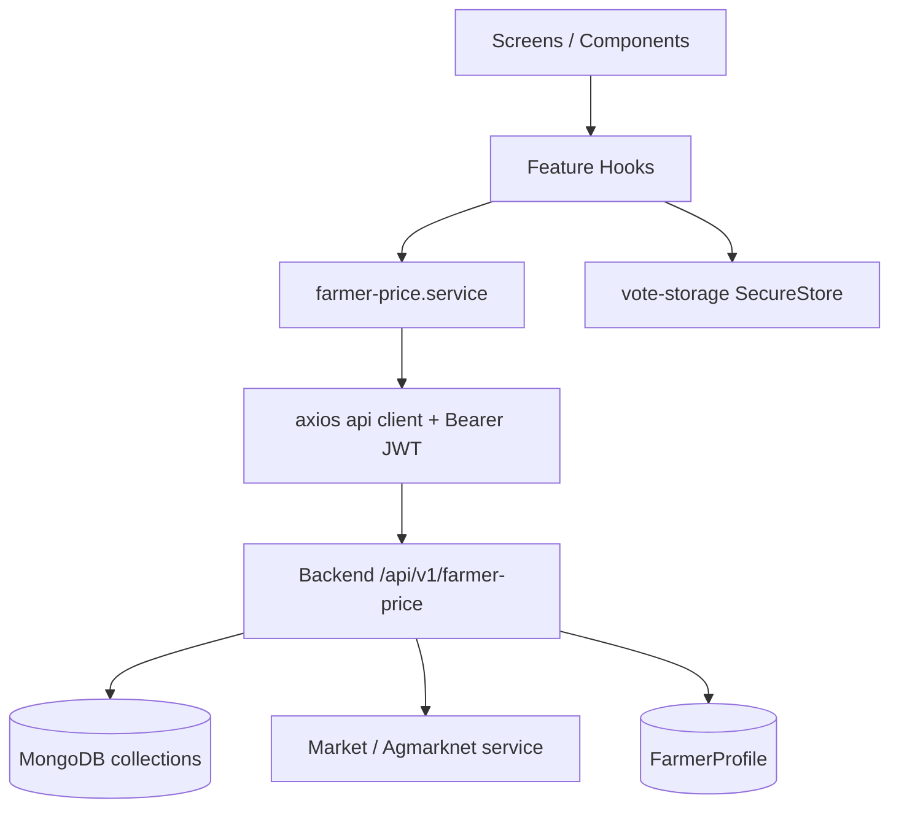

# Farmer Expected Price Module

> **Scope:** Complete Farmer Expected Price feature — mobile (`Mobile App/src/features/farmer-price/`) + backend (`Backend/backend/src/modules/farmer-price/`) + MongoDB  
> **Audience:** Engineers joining or maintaining this production module  
> **Source of truth:** Current repository implementation (August 2026)  
> **Related docs:** [`../mobile-app-documentation.md`](../mobile-app-documentation.md), [`../backend-documentation.md`](../backend-documentation.md), [`../profileScreen.md`](../profileScreen.md)

---

## Purpose

The Farmer Expected Price module lets Maharashtra farmers submit what price they **expect** for a crop in their district, then see a **community consensus** once enough opinions exist.

It is responsible for:

| Responsibility | Description |
|---|---|
| **Automatic poll creation** | Open polls for `(district, crop)` pairs from farmer favourite crops (scheduler + on-demand ensure) |
| **Government price snapshot** | Freeze Agmarknet modal price at poll creation time (unit: Quintal) |
| **Voting** | One integer expected price per farmer per poll, with mandatory reasons when price ≠ government |
| **Community estimate** | Median of votes after **10** opinions; confidence grows with vote count |
| **Market signals** | Aggregated reason-type counts (“why farmers think this”) |
| **Community insights** | Last 5 anonymous reason notes on a poll |
| **Poll lifecycle** | **72-hour** open window; status derived from `endsAt` (not stored) |
| **History (API)** | Closed polls for a crop in the farmer’s district |
| **Mobile UX** | Tab list + poll detail (vote + community view); Marathi-first copy |

Without favourite crops on the profile, the mobile home screen cannot surface polls. Without a completed profile / JWT, all farmer-price APIs reject the caller.

This document treats **backend + mobile + MongoDB** as **one production module**.

---

## Features

| Feature | Where | Notes |
|---|---|---|
| Farmer Price Home | Tab `farmer-price` → `FarmerPriceScreen` | Open polls for district + favourite crops |
| Poll Detail | Stack `farmer-price-detail/[pollId]` | Vote composer + community blocks |
| Community View | Detail screen sections | Community price, difference, confidence, signals, insights |
| Voting flow | `VoteCard` → `POST …/vote` | Slider + optional reason chips |
| Community Insights | `CommunityInsights` | Up to 5 anonymous notes |
| Market Signals | `MarketSignals` (+ compact chips on home cards) | Reason aggregates |
| History | **Backend API only** | `GET /history/:crop` — **no mobile UI yet** |
| Poll creation | Scheduler + `GET /polls/my` ensure + `POST /polls` | Open-slot concurrency for ensure/sync |
| Thank-you / already voted | `ThankYouCard` + SecureStore cache | Authoritative state = `poll.hasVoted` |
| Pull-to-refresh / focus revalidate | Home screen | Silent refresh when returning from detail |
| Background sync | `farmer-price.scheduler` | Every **60** minutes + once on server start |
| **Milk (दूध)** | Profile `favoriteCrops` + ensure/sync | Special favourite item — polls/votes like any crop; **no** Agmarknet government price (`governmentPriceAvailable: false`) |

> **Milk note:** Milk is treated as a special supported favourite item for Farmer Expected Price. It is intentionally excluded from Government Market Prices because no official Agmarknet government price exists. Stored as `"Milk"` in `favoriteCrops[]` — no separate Dairy module.

---

## Folder Structure

### Mobile

```
Mobile App/src/features/farmer-price/
├── FarmerPriceScreen.tsx                 # Tab list (home)
├── farmer-price.service.ts               # HTTP adapter (3 calls + hydrate helper)
├── farmer-price.types.ts                 # DTOs / enums aligned with backend
├── farmer-price.strings.ts               # Feature copy (Marathi + English)
├── farmer-price.constants.ts             # Client thresholds (display / form gates)
├── farmer-price.utils.ts                 # Range, format, display-vote helpers
├── farmer-price.vote-storage.ts          # SecureStore thank-you snapshot cache
├── components/
│   ├── PollCard.tsx                      # Home summary card (memo)
│   ├── VoteCard.tsx                      # Opinion composer
│   ├── ThankYouCard.tsx                  # Post-vote confirmation
│   ├── PriceSlider.tsx                   # PanResponder slider (memo)
│   ├── ReasonChips.tsx                   # Reason type picker (memo)
│   ├── MarketSignals.tsx                 # compact | full signal bars (memo)
│   ├── CommunityInsights.tsx             # Recent anonymous notes (memo)
│   ├── ConfidenceBadge.tsx               # Confidence pill (memo)
│   ├── PriceDelta.tsx                    # % difference chip (memo)
│   └── FarmerPriceSkeleton.tsx           # List loading placeholders
├── hooks/
│   ├── useMyFarmerPricePoll.ts           # Home: my polls + detail hydrate
│   ├── useFarmerPricePollDetail.ts       # Detail: single poll + local vote
│   └── useSubmitFarmerVote.ts            # Vote submit + SecureStore save
└── screens/
    └── PollDetailScreen.tsx              # Detail / vote / community UI

App routes (thin re-exports):
├── src/app/(tabs)/farmer-price.tsx
├── src/app/(tabs)/_layout.tsx            # Tab registration (currency-inr)
└── src/app/farmer-price-detail/[pollId].tsx
└── src/app/_layout.tsx                   # Stack title: Community Price
```

### Backend

```
Backend/backend/src/modules/farmer-price/
├── farmer-price.constants.ts             # Enums + numeric / string constants
├── farmer-price.types.ts                 # Documents, requests, response DTOs
├── farmer-price.model.ts                 # farmer_price_polls + farmer_price_votes
├── farmer-price.slot.ts                  # farmer_price_open_slots lock helpers
├── farmer-price.validation.ts            # Create / vote validation + price band
├── farmer-price.stats.ts                 # Median, confidence, diffs, remaining hours
├── farmer-price.stats.verify.ts          # Local asserts for stats helpers
├── farmer-price.service.ts               # Core business logic
├── farmer-price.controller.ts            # Express handlers + query parsers
├── farmer-price.routes.ts                # Route table (all authenticate)
├── farmer-price.sync.service.ts          # Profile-driven poll sync
└── farmer-price.scheduler.ts             # Interval wrapper around sync

Mount: Backend/backend/src/routes/index.ts
  router.use("/api/v1/farmer-price", farmerPriceRoutes)

Startup: Backend/backend/src/server.ts
  startFarmerPriceScheduler()  // after DB connect; failures logged, HTTP still starts

Scripts (ops / QA, not runtime APIs):
├── scripts/farmer-price.qa.ts
├── scripts/farmer-price.sync.verify.ts
├── scripts/farmer-price.investigate-empty.ts
└── scripts/farmer-price.vote-bug.investigate.ts
```

---

## File Responsibilities

### Mobile

| File | Responsibility |
|---|---|
| `farmer-price.service.ts` | Sole HTTP adapter for mobile-used endpoints |
| `farmer-price.types.ts` | TypeScript contracts mirrored from backend |
| `farmer-price.strings.ts` | Feature-local UI copy + reason/confidence labels |
| `farmer-price.constants.ts` | Client mirrors of thresholds (UI gating only) |
| `farmer-price.utils.ts` | `resolveAllowedRange`, formatters, `resolveDisplayVote` |
| `farmer-price.vote-storage.ts` | Per-user SecureStore map of submitted votes |
| `useMyFarmerPricePoll` | Load / refresh / silent revalidate of hydrated polls |
| `useFarmerPricePollDetail` | Single poll + optimistic/local display vote |
| `useSubmitFarmerVote` | POST vote; persist SecureStore on success |
| `FarmerPriceScreen` | Home list orchestration + empty/error states |
| `PollDetailScreen` | Vote + community layout + snackbars |
| `PollCard` | Summary + CTA focus `vote` \| `community` |
| `VoteCard` | Slider, digits, reason chips, client validation |
| `ThankYouCard` | Confirmation after vote |
| `MarketSignals` / `CommunityInsights` | Community view blocks |
| `ConfidenceBadge` / `PriceDelta` | Visual chips |
| `FarmerPriceSkeleton` | Initial list loading |

### Backend

| File | Responsibility |
|---|---|
| `farmer-price.routes.ts` | Wire HTTP paths + `authenticate` |
| `farmer-price.controller.ts` | Parse query/body; map service errors → HTTP |
| `farmer-price.service.ts` | Polls, votes, ensure, history, aggregation writes |
| `farmer-price.sync.service.ts` | Scan profiles → create missing open polls |
| `farmer-price.scheduler.ts` | Hourly + startup sync; in-process single-flight |
| `farmer-price.slot.ts` | Unique `(district, crop)` open-slot claim/release/bind |
| `farmer-price.validation.ts` | Integer price band; reason rules |
| `farmer-price.stats.ts` | Pure median / confidence / difference helpers |
| `farmer-price.model.ts` | Mongoose schemas + indexes |
| `farmer-price.constants.ts` | Single source of numeric / enum constants |

### Related modules (not under `farmer-price/`)

| Module | Used for |
|---|---|
| `features/profile/*` | District + `favoriteCrops` (eligibility + empty-state CTA) |
| `features/crop/*` | `getCropLabel` / `useCrops` for Marathi labels |
| `features/auth/*` | JWT on `api` client; user id for SecureStore keys |
| Market / Agmarknet service | `getMarketPrices` at poll creation (gov snapshot) |
| `config/maharashtraDistrictCoordinates` | `resolveDistrict` normalization |
| Auth middleware | `authenticate` on every farmer-price route |

---

## Screen Overview

The mobile app exposes **two screens**. “Community View”, voting UI, signals, and insights live on **Poll Detail**. History exists as a **backend API** without a screen.

### 1. Farmer Price Home (`FarmerPriceScreen`)

| Aspect | Detail |
|---|---|
| **Purpose** | Show open polls for the farmer’s district and favourite crops; entry to vote or community |
| **Route** | `(tabs)/farmer-price` — `headerShown: false` |
| **Tab title** | `strings.tabs.farmerPrice` → `अपेक्षित भाव` |
| **Tab icon** | `currency-inr` |
| **Entry points** | Main tab bar |
| **Exit points** | → `/farmer-price-detail/[pollId]?focus=vote\|community`; → `/profile` when no favourites |
| **When it appears** | Always as a primary tab once the farmer can enter the app |

**UI sections**

1. Header — title / subtitle from `farmerPriceStrings.screen`
2. Body states — skeleton | network empty | no favourites | no polls | list
3. List — “Your crops” + one `PollCard` per poll
4. Footer disclaimer (`disclaimer.line1` / `line2`)
5. Pull-to-refresh; snackbar when refresh fails but cached polls exist
6. Focus revalidate — first focus skipped; later focuses call silent `revalidate()`

**Not on this screen:** VoteCard, ThankYouCard, full MarketSignals, CommunityInsights, History.

---

### 2. Poll Detail (`PollDetailScreen`)

| Aspect | Detail |
|---|---|
| **Purpose** | Submit / confirm vote and view community consensus for one poll |
| **Route** | `farmer-price-detail/[pollId]` — stack card, `headerShown: true` |
| **Title** | `farmerPriceStrings.detail.title` → `Community Price` |
| **Entry points** | `PollCard` CTA with `focus: 'vote' \| 'community'` |
| **Exit points** | Stack back to Home |
| **When it appears** | After tapping a poll card |

**Layout modes**

| Mode | Layout |
|---|---|
| **Unvoted** | Government → Opinion (`VoteCard` or closed) → Community → Difference → Stats → MarketSignals → Insights |
| **Voted** | `ThankYouCard` first, then same community blocks |

Auto-scroll: prefers vote section when `focus === 'vote'` or user has not voted (`preferVoteFocus`), after ~280 ms. After successful submit, scrolls to top.

**Sections (order)**

1. Header — crop label + district  
2. Government price card  
3. Opinion — ThankYou \| closed message \| VoteCard (+ first-voice hint if `voteCount === 0`)  
4. Community expected price — revealed or waiting progress vs `MINIMUM_VOTES_REQUIRED` (10)  
5. Difference card (`PriceDelta` when available)  
6. Stats — opinions / confidence / window + remaining-hours bar  
7. `MarketSignals` (`variant="full"`)  
8. `CommunityInsights`  
9. Backend `poll.disclaimer`  
10. Snackbar for vote success / errors  

---

### 3. Community View (section, not a separate route)

Rendered on Poll Detail when viewing community blocks.

| Block | Source fields | Visibility |
|---|---|---|
| Community Expected Price | `communityExpectedPrice`, `minimumVotesReached` | Shown as price when `minimumVotesReached && communityExpectedPrice !== null`; else waiting UI |
| Confidence | `confidence` | Badge; `NOT_AVAILABLE` until ≥ 10 votes |
| Difference | `differenceFromGovernmentPrice`, `differencePercentage` | Null until community + gov available |
| Market Signals | `marketSignals[]` | Detail full list; home card shows top **3** (`HOME_SIGNALS_LIMIT`) |
| Insights | `recentInsights[]` | Up to **5**; author always anonymous string from backend |

---

### 4. History (API-only today)

| Aspect | Detail |
|---|---|
| **Purpose** | Closed polls for a crop in the farmer’s district |
| **Endpoint** | `GET /api/v1/farmer-price/history/:crop` |
| **Mobile** | **Not implemented** — no service call, no screen |
| **Documented here** | So engineers know the backend contract for a future History UI |

---

## Architecture

### Layered flow



### End-to-end data path

```
Screen
  ↓
Hooks (loading / refresh / submit / optimistic UI)
  ↓
Services (DTO ↔ HTTP)
  ↓
API client (Authorization: Bearer <JWT>)
  ↓
Backend routes → controller → service
  ↓
MongoDB (polls / votes / open_slots) + Profile + Market snapshot
  ↓
Response DTO envelope { success, data }
  ↓
UI (cards, chips, thank-you, snackbars)
```

### Source of truth

| Concern | Source of truth |
|---|---|
| Poll fields & aggregates | `farmer_price_polls` document |
| Whether caller voted | Backend `hasVoted` / `myVote` (from `farmer_price_votes`) |
| Thank-you snapshot UX | SecureStore best-effort; must not override backend on conflict |
| Community price | Server median after ≥ 10 votes — client never invents |
| Confidence / differences | Server `farmer-price.stats.ts` |
| Open vs closed | Derived: `endsAt > now` → `OPEN`, else `CLOSED` |
| Favourite crops / district | Farmer profile |
| Government snapshot | Frozen at poll creation; not live-refetched per vote |

There is **no** global Zustand/Redux store for farmer-price. State lives in hook React state + SecureStore cache.

---

## Backend Integration

### Module mount & startup

| Item | Implementation |
|---|---|
| Base path | `/api/v1/farmer-price` |
| Auth | Every route: `authenticate` |
| Scheduler | `startFarmerPriceScheduler()` in `server.ts` after DB connect |
| Sync interval | `FARMER_PRICE_SYNC_INTERVAL_MINUTES = 60` |
| Sync single-flight | In-process `syncInFlight`; overlapping runs skipped |
| Interval handle | `unref()` so it does not keep Node alive alone |

### Controllers

| Handler | Role |
|---|---|
| `createPollHandler` | Validate body → `createPoll` → **201** |
| `getPollsHandler` | Parse `district?`, `crop?`, `page`, `limit` → paginated list |
| `getMyPollsHandler` | Profile-driven ensure + open polls for favourites |
| `getPollHandler` | Detail DTO + caller vote + signals/insights |
| `submitVoteHandler` | Validate → `submitVote` → **201** detail |
| `getHistoryHandler` | Closed polls for profile district + path `crop` |

### Services (core exports)

| Export | Behaviour |
|---|---|
| `createPoll` | Normalize district; reject if active open poll; fetch gov snapshot; window now → +72h |
| `getPolls` | Optional filters; sort `endsAt: -1`; pagination |
| `getPoll` | By id → detail DTO |
| `getMyPolls` | Require profile district; empty favourites → `[]`; ensure missing opens; sort `endsAt: 1` with vote flags |
| `submitVote` | OPEN poll; district match; favourite crop; one vote; persist + recalc; return detail |
| `getHistory` | `endsAt <= now`, district + crop, limit **50**, sort `endsAt: -1` |
| `runFarmerPriceSync` | Profile scan → claim slot → create missing polls |

### Validation (`farmer-price.validation.ts`)

| Rule | Detail |
|---|---|
| Create poll | `crop`, `district` required non-empty strings |
| Vote price | Must be **integer**; within `getAllowedPriceRange` |
| Band with gov | `min = ceil(snapshot * 0.6)`, `max = floor(snapshot * 1.4)` (±40%) |
| Band without gov | `1000` … `100000` |
| Reason when ≠ gov | Both `reasonType` and `reasonText` required |
| Reason length | Trimmed text **10–200** chars |
| Reason enum | Must be one of `REASON_TYPES` |
| Query | Empty string filters → 400; `page >= 1`; `limit` 1..100 |

### DTOs

See [Appendix](#appendix) for full shapes. Primary responses: `PollResponseDTO`, `PollDetailResponseDTO`, `PaginatedPollsDTO`, `HistoryResponseDTO`.

### Background scheduler & atomic creation

**Hourly sync (`runFarmerPriceSync`)**

1. Scan all `FarmerProfile` documents for district + `favoriteCrops`.  
2. Count farmers per `(district, crop)`.  
3. Eligible if count ≥ `MIN_FARMERS_PER_POLL` (**1**).  
4. Skip pairs that already have an open poll (`endsAt > now`).  
5. `claimOpenSlot` → re-check → `createPoll` → `bindOpenSlotToPoll`; on conflict release/bind.  
6. Idempotent: second sync should create **0** (verified by `farmer-price.sync.verify.ts`).

**On-demand ensure (`GET /polls/my`)**

For each favourite crop missing an open poll:

1. Claim open slot (unique `(district, crop)`).  
2. Winner creates poll and binds slot.  
3. Losers wait up to `ENSURE_PEER_WAIT_MS` (**8000**) polling every `ENSURE_PEER_POLL_INTERVAL_MS` (**75**).

**Concurrency note:** Manual `POST /polls` uses `findActivePoll` then create — it does **not** use the open-slot lock (possible race vs ensure/sync). Prefer ensure/sync paths in production.

### Vote aggregation

After each successful vote:

1. Prefer Mongo **transaction**: insert vote + reload all vote prices + `$set` poll aggregates.  
2. Up to **`VOTE_TRANSACTION_MAX_ATTEMPTS = 8`** retries on transient write conflicts (backoff `25 * attempt` ms).  
3. If transactions unsupported (standalone): insert vote then update poll; on poll-update failure **delete** the vote (compensating rollback).  
4. Aggregates: `voteCount`, median → `communityExpectedPrice` (null if &lt; 10), `confidence`, `minimumVotesReached`, `lastVoteAt`.

### Market signals & insights

| Feature | Implementation |
|---|---|
| Market signals | Aggregate `$group` by `reasonType`, sort by count desc |
| Recent insights | Last **5** votes with both `reasonType` and non-empty `reasonText` |
| Author | Always `ANONYMOUS_FARMER_AUTHOR` = `"Anonymous Farmer"` |
| Disclaimer | `COMMUNITY_PRICE_DISCLAIMER` constant on detail DTO |

---

## MongoDB

### Collections involved

| Collection | Model | Purpose |
|---|---|---|
| `farmer_price_polls` | `FarmerPricePoll` | Open/closed poll documents + rolled-up stats |
| `farmer_price_votes` | `FarmerPriceVote` | One vote per `(pollId, userId)` |
| `farmer_price_open_slots` | `FarmerPriceOpenSlot` | Concurrency lock for one open poll per `(district, crop)` |
| `farmerprofiles` (existing) | `FarmerProfile` | **Read** for district + favourite crops (ensure + sync) |
| Market price source | External / market module | Read at poll create only |

`farmer_price_open_slots` is defined in `farmer-price.slot.ts` (not `farmer-price.model.ts`).

---

### `farmer_price_polls`

**Purpose:** Canonical poll + aggregate community stats.

| Field | Notes |
|---|---|
| `crop`, `district` | Required, trimmed, indexed |
| `governmentPriceSnapshot` | Number \| null, min 0 |
| `governmentPriceDate` | Date \| null |
| `governmentUnit` | String \| null (typically `"Quintal"`) |
| `governmentPriceAvailable` | Boolean |
| `communityExpectedPrice` | Number \| null until ≥ 10 votes |
| `voteCount` | ≥ 0 |
| `confidence` | enum `CONFIDENCE_LEVELS`, default `NOT_AVAILABLE` |
| `minimumVotesReached` | Boolean |
| `lastVoteAt` | Date \| null, indexed |
| `startsAt`, `endsAt` | Required; `endsAt` indexed |
| `createdAt`, `updatedAt` | timestamps |

**Indexes**

- Single: `crop`, `district`, `lastVoteAt`, `endsAt`  
- Compound: `{ district: 1, crop: 1, endsAt: -1 }`  

**No unique index** on active `(district, crop)`. Uniqueness of *open* polls is enforced via open-slot + application checks.

**Status:** Not stored. Derived in DTO mapping.

**Read paths:** list, my, by id, history (closed), sync “existing open” checks.  
**Write paths:** create; post-vote `$set` aggregates.

---

### `farmer_price_votes`

**Purpose:** Immutable vote rows (no `updatedAt`).

| Field | Notes |
|---|---|
| `pollId` | ObjectId → poll, indexed |
| `userId` | ObjectId → `AuthUser`, indexed |
| `district`, `crop` | Denormalized, indexed |
| `expectedPrice` | Number ≥ 0 |
| `reasonType` | Optional enum |
| `reasonText` | Optional trimmed string |
| `createdAt` | Only |

**Indexes**

- **Unique** `{ pollId: 1, userId: 1 }` — hard duplicate-vote guarantee  
- `{ pollId: 1, createdAt: -1 }` — insights / ordering  

**Write path:** insert on vote (transactional with poll update when possible).  
**Read path:** caller vote lookup; all prices for median; signals aggregation; insights.

---

### `farmer_price_open_slots`

**Purpose:** At most one open-slot lease per `(district, crop)`.

| Field | Notes |
|---|---|
| `district`, `crop` | Required |
| `pollId` | ObjectId \| null until bound |
| `endsAt` | Slot lease / poll end |
| timestamps | yes |

**Unique index:** `{ district: 1, crop: 1 }`.

**Operations:** `claimOpenSlot` (`findOneAndUpdate` reclaim when `endsAt <= now`, else create); `bindOpenSlotToPoll`; release on failure/conflict.

---

### Relationships

```
FarmerProfile (district, favoriteCrops)
        │
        ▼ (ensure / sync)
farmer_price_open_slots ──bind──► farmer_price_polls
                                        ▲
                                        │ pollId
                                 farmer_price_votes
                                        │
                                        ▼ userId
                                   AuthUser
```

### Transactions

- Vote path prefers `session.withTransaction`.  
- Standalone Mongo without transactions uses compensating delete on poll-update failure.  
- Open-slot uniqueness is index-backed, not multi-document transactional with poll create (claim → create → bind sequence).

### Aggregation pipelines

- Market signals: `$match` pollId → `$group` by `reasonType` → sort by count.  
- Median: load vote prices into memory → `calculateMedianPrice` (not `$median` operator).  
- Sync: application-level grouping of profiles (not a single aggregation pipeline for creates).

### Source of truth summary

| Data | Collection / system |
|---|---|
| Poll window & gov snapshot | `farmer_price_polls` |
| Votes | `farmer_price_votes` |
| Open uniqueness lock | `farmer_price_open_slots` |
| Who may vote / which crops | Profile |
| Live mandi feed | Market service (create-time snapshot only) |

---

## APIs

All success responses:

```ts
type ApiSuccessResponse<T> = {
  success: true;
  data: T;
};
```

Base: `/api/v1/farmer-price`  
Auth: **Required** (Bearer JWT) on every route below.  
Caching: **No HTTP cache** headers implemented in this module. Clients use in-memory + SecureStore.  
Retry: Client uses pull-to-refresh / Retry buttons; vote transactions retry server-side up to 8 times.

---

### 1. `POST /api/v1/farmer-price/polls`

| Field | Value |
|---|---|
| **Method** | `POST` |
| **Auth** | Required |
| **Business purpose** | Manually create an open poll for district + crop |
| **Request body** | `{ crop: string, district: string }` |
| **Response `data`** | `PollResponseDTO` |
| **Success status** | **201** |
| **Validation** | Non-empty crop/district |
| **Errors** | 400 validation; **409** `"Poll already exists."` if open poll present |
| **Mobile usage** | **Not called** |

```json
{
  "crop": "Onion",
  "district": "Nashik"
}
```

---

### 2. `GET /api/v1/farmer-price/polls`

| Field | Value |
|---|---|
| **Method** | `GET` |
| **Auth** | Required |
| **Business purpose** | Paginated poll browse / admin-style listing |
| **Query** | `district?`, `crop?`, `page` (default **1**), `limit` (default **20**, max **100**) |
| **Response `data`** | `PaginatedPollsDTO` |
| **Notes** | Does **not** attach caller votes → `hasVoted: false`, `myVote: null` always |
| **Mobile usage** | **Not called** |

---

### 3. `GET /api/v1/farmer-price/polls/my`

| Field | Value |
|---|---|
| **Method** | `GET` |
| **Auth** | Required |
| **Business purpose** | Farmer’s open polls for favourite crops; **creates missing polls** via ensure |
| **Request** | None (district + favourites from profile) |
| **Response `data`** | `PollResponseDTO[]` |
| **Errors** | **400** `"Invalid District"` if profile district missing |
| **Empty favourites** | `[]` |
| **Refresh** | Mobile: pull-to-refresh, focus revalidate |
| **Mobile usage** | **Primary home load** via `getMyPolls` / `getMyPollDetails` |

---

### 4. `GET /api/v1/farmer-price/polls/:pollId`

| Field | Value |
|---|---|
| **Method** | `GET` |
| **Auth** | Required |
| **Business purpose** | Full poll detail for community view + vote UI |
| **Path** | `pollId` (ObjectId) |
| **Response `data`** | `PollDetailResponseDTO` |
| **Includes** | `remainingHours`, `marketSignals`, `recentInsights`, `disclaimer`, `hasVoted`, `myVote` |
| **Errors** | 400 invalid id; **404** `"Poll Not Found"` |
| **Mobile usage** | Detail screen + home hydration (`Promise.all` per poll) |

---

### 5. `POST /api/v1/farmer-price/polls/:pollId/vote`

| Field | Value |
|---|---|
| **Method** | `POST` |
| **Auth** | Required |
| **Business purpose** | Submit one expected-price vote |
| **Request body** | `SubmitVoteBody` |
| **Response `data`** | `PollDetailResponseDTO` (with `hasVoted: true`) |
| **Success status** | **201** |
| **Errors** | See [Failure Matrix](#failure-matrix) |
| **Retry** | Server retries transient transaction conflicts; client should not double-submit while `submitting` |
| **Mobile usage** | `submitFarmerVote` |

```json
{
  "expectedPrice": 2200,
  "reasonType": "HIGH_DEMAND",
  "reasonText": "Mandi demand is strong this week."
}
```

When price **equals** government snapshot (and gov available), `reasonType` / `reasonText` may be omitted.

---

### 6. `GET /api/v1/farmer-price/history/:crop`

| Field | Value |
|---|---|
| **Method** | `GET` |
| **Auth** | Required |
| **Business purpose** | Closed poll history for crop in farmer’s district |
| **Path** | `crop` |
| **District** | From profile (`resolveDistrict`) |
| **Response `data`** | `HistoryResponseDTO` |
| **Limit** | **50** closed polls, `endsAt` desc |
| **Errors** | **400** `"Invalid District"` if profile district missing |
| **Mobile usage** | **Not called** |

---

### Mobile service mapping

| Client function | API |
|---|---|
| `getMyPolls` | `GET /polls/my` |
| `getPollById` | `GET /polls/:pollId` |
| `getMyPollDetails` | `getMyPolls` + parallel `getPollById` |
| `submitFarmerVote` | `POST /polls/:pollId/vote` |

---

## Business Rules

| # | Rule | Value / behaviour |
|---|---|---|
| 1 | Automatic poll creation | Scheduler hourly + startup; also ensure on `GET /polls/my` |
| 2 | Min farmers for sync pair | `MIN_FARMERS_PER_POLL = 1` |
| 3 | Poll duration | `DEFAULT_POLL_DURATION_HOURS = 72` |
| 4 | Poll status | Derived from `endsAt` vs now (`OPEN` / `CLOSED`) |
| 5 | One vote per farmer per poll | Unique index + pre-check → `"Already Voted"` |
| 6 | Favourite crop restriction | Crop must be in `profile.favoriteCrops` or **403** `"Favourite Crop Required"` |
| 7 | District restriction | Profile district must match poll district or **403** `"Invalid District"` |
| 8 | Government price snapshot | Taken at create via `getMarketPrices` (Maharashtra, district, commodity); highest positive `modalPrice` among returned; unit `"Quintal"` |
| 9 | Missing government price | Poll still created; `governmentPriceAvailable: false`; wider price band |
| 10 | Community price reveal | `communityExpectedPrice` null until `voteCount >= MINIMUM_VOTES_REQUIRED` (**10**) |
| 11 | Community statistic | **Median** of expected prices (even count → round average of two middles) |
| 12 | Confidence | &lt;10 `NOT_AVAILABLE`; &lt;50 `LOW`; &lt;150 `MEDIUM`; else `HIGH` |
| 13 | Difference | `community - gov`; % rounded to 2 decimals; null if community or gov missing/zero |
| 14 | ±40% validation | With gov: ceil(0.6×) … floor(1.4×); without: 1000…100000. **Milk exception:** fixed ₹30–₹150 / Litre via `MILK_PRICE_RANGE` (never ±40%) |
| 15 | Mandatory reasons | If price ≠ gov snapshot (when available): require `reasonType` + reason text 10–200 |
| 16 | Reason optional | Only when matching government price |
| 17 | Insights anonymity | Author always `"Anonymous Farmer"` |
| 18 | Insights limit | 5 most recent with reason type + text |
| 19 | History | Closed polls only; district from profile; crop from path; max 50 |
| 20 | Open-slot uniqueness | One open lease per `(district, crop)` |
| 21 | Paginated list vote flags | `GET /polls` never loads caller votes |
| 22 | Integer prices only | Non-integer → `"Invalid Vote"` |
| 23 | Closed poll voting | **400** `"Poll Closed"` |
| 24 | Disclaimer | Fixed community estimate disclaimer on detail DTO |
| 25 | Milk (दूध) | Allowed in `favoriteCrops` as `"Milk"`; ensure/sync/vote identical; no Agmarknet price; `allowedPriceRange` = `{ min: 30, max: 150, unit: "Litre" }` from `getAllowedPriceRange` |

---

## Voting Flow

Complete lifecycle (as implemented):

```
Farmer opens app / Farmer Price tab
  ↓
Mobile loads profile (favourite crops) + GET /polls/my
  ↓
Backend: profile district + favoriteCrops
  ↓
For each favourite crop: open poll exists?
  ↓ no
claimOpenSlot → createPoll (gov snapshot, 72h window) → bind slot
  ↓ yes / after ensure
Return PollResponseDTO[] (with hasVoted / myVote)
  ↓
Mobile hydrates each with GET /polls/:id (signals, remainingHours)
  ↓
Farmer taps card → Poll Detail
  ↓
If not voted and OPEN → VoteCard (slider / reasons)
  ↓
POST /polls/:pollId/vote
  ↓
Checks: poll exists, OPEN, district match, favourite crop, not already voted, validation
  ↓
Insert vote (+ transaction) → reload prices → median / confidence / community
  ↓
Return PollDetailResponseDTO
  ↓
Mobile: ThankYouCard + SecureStore snapshot + refresh aggregates
  ↓
When voteCount ≥ 10 → communityExpectedPrice visible; market signals / insights update
  ↓
After endsAt → CLOSED; available via GET /history/:crop (API); new cycle via sync/ensure
```

---

## Community View

### Signals

- Array of `{ reasonType, farmerCount }` sorted by count.  
- Home: top **3** chips (`HOME_SIGNALS_LIMIT`).  
- Detail: full `MarketSignals` bars.

### Insights

- `{ reasonType, reasonText, createdAt, author }`  
- `author` always anonymous constant.  
- Cap: `RECENT_INSIGHTS_LIMIT = 5`.

### Confidence

| Votes | Level |
|---|---|
| 0–9 | `NOT_AVAILABLE` |
| 10–49 | `LOW` |
| 50–149 | `MEDIUM` |
| 150+ | `HIGH` |

### Community Expected Price

- Null until threshold.  
- Then median of all `expectedPrice` values.  
- `minimumVotesReached` mirrors threshold.

### Difference calculations

```
differenceFromGovernmentPrice = communityExpectedPrice - governmentPriceSnapshot
differencePercentage = round((diff / governmentPriceSnapshot) * 10000) / 100
```

Null when community missing, gov unavailable, or gov snapshot null/0.

### Visibility rules

| UI | Rule |
|---|---|
| Waiting community | `!minimumVotesReached` or null community price |
| Revealed community | `minimumVotesReached && communityExpectedPrice !== null` |
| Difference chip | Both community and gov available |
| Vote composer | `status === 'OPEN'` and `remainingHours > 0` and `!hasVoted` |
| Thank you | `hasVoted` (backend) |

---

## Screen States

| State | Home | Detail |
|---|---|---|
| **Loading** | `FarmerPriceSkeleton` when `(loading \|\| profileLoading) && polls.length===0 && !error` | Centered `ActivityIndicator` when `loading && !poll` |
| **No polls** | Empty copy + Refresh | — |
| **No favourites** | CTA → Profile | — |
| **Network / error (empty)** | `EmptyState` wifi-off + Retry | EmptyState / error + Retry |
| **Error with cache** | Snackbar over list | Error text while poll shown |
| **No vote** | Card CTA Share / Continue (`focus=vote`) | `VoteCard` |
| **Already voted** | Card reflects `hasVoted` | `ThankYouCard` |
| **Consensus pending** | Status / waiting copy (need 10) | Progress vs 10 |
| **Consensus available** | Community tile + confidence | Price + delta + signals |
| **Closed** | Card may show closed timing | Closed message; no VoteCard |
| **History** | Not implemented | Not implemented |
| **Offline** | Treated as load/refresh error (no dedicated offline queue) | Same |

---

## Performance

| Area | Implementation |
|---|---|
| **Caching** | In-memory polls in hooks; SecureStore thank-you map `farmerPriceSubmittedVotes` |
| **Refresh strategy** | Home: pull refresh + silent focus revalidate; Detail: refresh after vote |
| **Memoization** | `PollCard`, slider, chips, signals, insights, badges, delta; crop label map on home |
| **Batch queries** | Home: one `/polls/my` then parallel detail GETs (`Promise.all`) |
| **SecureStore** | Single JSON blob; in-memory mirror; optional native module; memory fallback |
| **Backend** | Compound district/crop/endsAt index; unique vote index; open-slot unique |
| **Single-flight** | Scheduler `syncInFlight`; list hook **request-id** (latest wins, not hard lock) |
| **Concurrency** | Open-slot claims; vote transaction retries; peer wait on ensure race |
| **Cost note** | Each vote reloads **all** vote prices for that poll to recompute median |

---

## Security

| Concern | Implementation |
|---|---|
| **Authentication** | JWT via `authenticate` on all routes; mobile `api` Bearer token |
| **Authorization** | Vote only if district matches + crop in favourites |
| **Vote ownership** | `userId` from auth context; `myVote` only for caller |
| **Duplicate vote** | Pre-check + unique `{ pollId, userId }`; duplicate key → 409 |
| **Abuse prevention** | ±40% / 1000–100000 band; reason length; integer-only; closed poll reject |
| **Validation** | Server authoritative; client mirrors for UX |
| **PII** | Insights never expose farmer name/phone — fixed anonymous author |
| **Client cache** | Keys `vote:<userId>:<pollId>`; `clearUserVoteCache` exported but **not wired to logout** today |

---

## Failure Matrix

| Failure | Backend | Mobile UX |
|---|---|---|
| **Vote validation fails** | 400 (`Invalid Vote`, `Reason Required`, length, enum) | Snackbar / inline error; stay on VoteCard |
| **Duplicate vote** | 409 `"Already Voted"` | `alreadyVoted` flag; refresh; show message; **no invented local vote** |
| **Poll missing** | 404 `"Poll Not Found"` | Detail empty + retry |
| **Poll closed** | 400 `"Poll Closed"` | Closed UI; no submit |
| **Wrong district** | 403 `"Invalid District"` | Error message |
| **Crop not favourite** | 403 `"Favourite Crop Required"` | Error message |
| **Network fails** | — | Home empty error or snackbar if cached; detail error |
| **Backend timeout** | Client axios error | Same as network; retry |
| **Offline** | — | No offline vote queue; errors on fetch/submit |
| **Government price unavailable** | Poll created with `governmentPriceAvailable: false` | Wider band; match-gov shortcut unavailable |
| **Ensure race lost** | Waiter polls up to 8s for winner’s poll | May briefly see fewer polls if wait expires empty |
| **Vote txn conflict** | Retry up to 8; else error | Submit error snackbar |
| **Standalone Mongo (no txn)** | Compensating vote delete if poll update fails | User may need to retry |
| **Sync failure** | Logged; HTTP unaffected | Next `/polls/my` / next hour may create |
| **No favourites** | `/polls/my` → `[]` | CTA to Profile |

---

## Production Decisions

| Decision | Why |
|---|---|
| **Median, not mean** | Resistant to extreme outliers from a few farmers |
| **10-vote reveal gate** | Avoid publishing a “community price” from 1–2 opinions |
| **Confidence tiers** | Communicate reliability without fake precision |
| **Freeze gov snapshot at create** | Stable vote band and fair comparison for the 72h window |
| **±40% band** | Block nonsense prices while allowing real market disagreement |
| **Reasons only when ≠ gov** | Reduce friction when agreeing with mandi; capture signal when disagreeing |
| **Open-slot collection** | Prevent duplicate open polls without a fragile unique partial index on polls |
| **Ensure on `/polls/my`** | Farmer always sees actionable polls without waiting for the hourly job |
| **Hourly sync** | Cover farmers who never open the tab; keep pairs warm |
| **Unique vote index** | Correctness under double-tap / flaky networks |
| **Anonymous insights** | Encourage honesty; avoid social pressure / privacy leaks |
| **Detail hydrate on home** | Home cards need signals/`remainingHours` that list DTO alone may not emphasize — trade N+1 GETs for richer cards |
| **SecureStore thank-you** | Instant confirmation UX across remounts; backend remains authority |
| **No History UI yet** | API ready; mobile scope focused on active voting cycle |
| **`MIN_FARMERS_PER_POLL = 1`** | Launch with low threshold so early districts still get polls |

---

## Production Readiness

### Scorecard

| Area | Score ( / 10) | Notes |
|---|---|---|
| **Backend** | **9.0** | Clear module, validation, transactions, scheduler, indexes |
| **Frontend** | **8.0** | Strong vote/community UX; History UI missing; logout cache clear unwired |
| **MongoDB** | **8.5** | Solid indexes + open slots; open poll uniqueness not a DB unique on polls |
| **Performance** | **7.5** | Parallel detail hydrate is N+1; full-price reload per vote |
| **Security** | **9.0** | Auth, district/crop gates, unique votes, anonymous insights |
| **UX** | **8.0** | Clear states; Marathi+English mix; large touch targets on vote |
| **Scalability** | **7.0** | Fine for district-scale; median-all-votes may need incremental stats later |
| **Maintainability** | **8.5** | Shared constants/DTOs; scripts for sync/QA |

**Overall production readiness: 8.2 / 10**

### Known limitations

1. Mobile does not call History, list, or create-poll APIs.  
2. `POST /polls` lacks open-slot locking (race vs sync/ensure).  
3. `GET /polls` never returns caller `hasVoted` / `myVote`.  
4. Home detail hydration multiplies requests by favourite crop count.  
5. `clearUserVoteCache` not invoked on logout.  
6. Vote median recomputed from full vote set each time.  
7. Government snapshot quality depends on market feed sorting (highest modal among returned rows).  
8. No offline vote queue.

### Launch blockers

None identified for the **active vote + community reveal** path, assuming:

- JWT auth works  
- Profile has district + favourite crops  
- Mongo replica set recommended for vote transactions (standalone uses compensating path)  
- Market service reachable (polls still create without gov price)

---

## Developer Notes

Rules future engineers must **not** break:

1. **Server is authority** for community price, confidence, hasVoted, and validation — never invent consensus on the client.  
2. **Do not remove** the unique `{ pollId, userId }` index.  
3. **Do not reveal** `communityExpectedPrice` below 10 votes.  
4. **Do not change** ±40% / reason length rules in only one of mobile vs backend.  
5. **Do not expose** real farmer identity in insights.  
6. **Do not skip** open-slot claim on ensure/sync create paths.  
7. **Do not treat** SecureStore as source of truth over `poll.hasVoted`.  
8. **Do not store** poll `status` as a mutable field without migrating all readers — status is derived today.  
9. Prefer fixing races with slots/transactions over “check then insert” alone.  
10. Keep `disclaimer` honest: community estimate ≠ official mandi price.  
11. When adding History UI, reuse `GET /history/:crop` — do not scrape closed polls client-side incorrectly.  
12. Wire `clearUserVoteCache(userId)` on logout if touching auth cleanup.

---

## Testing Checklist

### Manual QA — Home

- [ ] Tab opens with skeleton then poll cards  
- [ ] No favourites → Profile CTA  
- [ ] No open polls → empty + Refresh  
- [ ] Offline / error empty → Retry  
- [ ] Cached list + failed refresh → snackbar  
- [ ] Pull-to-refresh updates vote counts  
- [ ] Return from detail silently revalidates  
- [ ] Card CTA opens detail with correct `focus`

### Manual QA — Voting

- [ ] Slider / digits clamp to `allowedPriceRange`  
- [ ] Match government hides reason requirement  
- [ ] Disagree requires reason chip + 10–200 text  
- [ ] Submit success → ThankYou + snackbar  
- [ ] Double submit → Already Voted / no duplicate  
- [ ] Wrong district / non-favourite crop → error  
- [ ] Closed poll → no VoteCard  

### Manual QA — Community

- [ ] &lt;10 votes → waiting UI, no community price  
- [ ] ≥10 → median shown + confidence badge  
- [ ] Difference chip vs government  
- [ ] Market signals update after reasoned votes  
- [ ] Insights anonymous and ≤5  

### Concurrency / API

- [ ] Two parallel `/polls/my` for same new crop → one poll  
- [ ] Sync twice → second creates 0 (`qa` / sync.verify scripts)  
- [ ] Parallel votes same user → one vote (409)  
- [ ] Parallel votes different users → count increments; median updates  

### Regression

- [ ] Profile favourite crop changes → new ensure on next `/polls/my`  
- [ ] Auth logout / login different user → no cross-user thank-you bleed (keys include userId)  
- [ ] TypeScript clean for touched farmer-price files  

### History (API)

- [ ] Closed poll appears in `GET /history/:crop`  
- [ ] Open poll does not  
- [ ] District isolation  

---

## Future Improvements

Realistic production follow-ups (not invented architecture):

1. **History screen** consuming existing `GET /history/:crop`.  
2. **Wire `clearUserVoteCache` on logout**.  
3. **Reduce N+1** — extend `/polls/my` to optionally include detail fields, or batch detail endpoint.  
4. **Use open-slot on `POST /polls`** for parity with ensure/sync.  
5. **Incremental / stored median helpers** if vote counts grow large.  
6. **Populate `hasVoted` on `GET /polls`** if that route becomes farmer-facing.  
7. **Replica-set transactions** in all environments for vote atomicity.  
8. Unify Marathi-only copy pass (home/detail still mixed EN/MR in places).

---

## Revision History

| Milestone | Summary |
|---|---|
| Initial farmer-price backend | Polls, votes, median, confidence, routes |
| Government snapshot | Agmarknet modal freeze at create |
| ±40% validation + reasons | Vote band + mandatory disagreement notes |
| Community reveal @ 10 | Gate community price + confidence tiers |
| Market signals + insights | Aggregates + last 5 anonymous notes |
| Open-slot concurrency | Unique `(district, crop)` create lock |
| `/polls/my` ensure | On-demand poll creation for favourites |
| Hourly scheduler | Profile-scan sync + startup run |
| Milk (दूध) favourite | Special supported item for Farmer Expected Price; excluded from Government Market; no Agmarknet price |
| Vote transactions | Session txn + retries / compensating path |
| Mobile home + detail | Tab list, VoteCard, community sections |
| SecureStore thank-you | Local submitted-vote snapshot |
| Detail hydrate | Parallel `getPollById` for richer cards |
| `hasVoted` / `myVote` | Cross-device already-voted authority |
| History API | Closed polls by crop (mobile UI pending) |

---

## Appendix

### A — Important enums

```ts
type PollStatus = "OPEN" | "CLOSED"; // derived, not stored

type ConfidenceLevel =
  | "NOT_AVAILABLE"
  | "LOW"
  | "MEDIUM"
  | "HIGH";

type ReasonType =
  | "HIGH_DEMAND"
  | "LOW_SUPPLY"
  | "GOOD_QUALITY"
  | "EXPORT_DEMAND"
  | "HIGH_TRANSPORT_COST"
  | "LOW_QUALITY"
  | "STORAGE_AVAILABLE"
  | "OTHER";
```

### B — Reason types (product meaning)

| Code | Typical meaning |
|---|---|
| `HIGH_DEMAND` | Strong buyer demand |
| `LOW_SUPPLY` | Tight supply |
| `GOOD_QUALITY` | Better quality expected |
| `EXPORT_DEMAND` | Export pull |
| `HIGH_TRANSPORT_COST` | Logistics inflate local expectation |
| `LOW_QUALITY` | Quality pressure on price |
| `STORAGE_AVAILABLE` | Storage changes urgency |
| `OTHER` | Free-text catch-all |

### C — Poll states

| State | Rule |
|---|---|
| `OPEN` | `endsAt > now` |
| `CLOSED` | `endsAt <= now` |

### D — Confidence levels

| Level | Vote count |
|---|---|
| `NOT_AVAILABLE` | &lt; 10 |
| `LOW` | 10–49 |
| `MEDIUM` | 50–149 |
| `HIGH` | ≥ 150 |

### E — Key constants

| Constant | Value |
|---|---|
| `DEFAULT_POLL_DURATION_HOURS` | 72 |
| `MINIMUM_VOTES_REQUIRED` | 10 |
| `PRICE_VARIATION_PERCENT` | 40 |
| `MIN_PRICE_WITHOUT_GOV` | 1000 |
| `MAX_PRICE_WITHOUT_GOV` | 100000 |
| `MIN_REASON_LENGTH` | 10 |
| `MAX_REASON_LENGTH` | 200 |
| `RECENT_INSIGHTS_LIMIT` | 5 |
| `DEFAULT_GOVERNMENT_UNIT` | `"Quintal"` |
| `FARMER_PRICE_SYNC_INTERVAL_MINUTES` | 60 |
| `MIN_FARMERS_PER_POLL` | 1 |
| `ENSURE_PEER_WAIT_MS` | 8000 |
| `ENSURE_PEER_POLL_INTERVAL_MS` | 75 |
| `VOTE_TRANSACTION_MAX_ATTEMPTS` | 8 |
| History limit | 50 |
| `HOME_SIGNALS_LIMIT` (mobile) | 3 |
| `PRICE_SLIDER_STEP` (mobile) | 10 |

### F — DTOs (abridged)

```ts
type AllowedPriceRangeDTO = { min: number; max: number };

type MyVoteDTO = {
  expectedPrice: number;
  reasonType?: ReasonType;
  reasonText?: string;
  createdAt: Date | string; // Date on server; ISO string on mobile JSON
};

type MarketSignalDTO = { reasonType: ReasonType; farmerCount: number };

type RecentInsightDTO = {
  reasonType: ReasonType;
  reasonText: string;
  createdAt: Date | string;
  author: string; // "Anonymous Farmer"
};

type PollResponseDTO = {
  id: string;
  crop: string;
  district: string;
  governmentPriceSnapshot: number | null;
  governmentPriceDate: Date | string | null;
  governmentUnit: string | null;
  governmentPriceAvailable: boolean;
  communityExpectedPrice: number | null;
  voteCount: number;
  confidence: ConfidenceLevel;
  minimumVotesReached: boolean;
  differenceFromGovernmentPrice: number | null;
  differencePercentage: number | null;
  allowedPriceRange: AllowedPriceRangeDTO;
  lastVoteAt: Date | string | null;
  startsAt: Date | string;
  endsAt: Date | string;
  status: PollStatus;
  createdAt: Date | string;
  updatedAt: Date | string;
  hasVoted: boolean;
  myVote: MyVoteDTO | null;
};

type PollDetailResponseDTO = PollResponseDTO & {
  remainingHours: number;
  marketSignals: MarketSignalDTO[];
  recentInsights: RecentInsightDTO[];
  isCommunityEstimate: true;
  disclaimer: string;
};

type SubmitVoteBody = {
  expectedPrice: number;
  reasonType?: ReasonType;
  reasonText?: string;
};

type HistoryPollDTO = {
  id: string;
  crop: string;
  district: string;
  startsAt: Date;
  endsAt: Date;
  governmentPriceSnapshot: number | null;
  communityExpectedPrice: number | null;
  voteCount: number;
  confidence: ConfidenceLevel;
  differenceFromGovernmentPrice: number | null;
  differencePercentage: number | null;
};

type HistoryResponseDTO = {
  crop: string;
  district: string;
  polls: HistoryPollDTO[];
};
```

### G — Sample success: poll detail

```json
{
  "success": true,
  "data": {
    "id": "66f1a2b3c4d5e6f7a8b9c0d1",
    "crop": "Onion",
    "district": "Nashik",
    "governmentPriceSnapshot": 2000,
    "governmentPriceDate": "2026-08-01T00:00:00.000Z",
    "governmentUnit": "Quintal",
    "governmentPriceAvailable": true,
    "communityExpectedPrice": 2150,
    "voteCount": 12,
    "confidence": "LOW",
    "minimumVotesReached": true,
    "differenceFromGovernmentPrice": 150,
    "differencePercentage": 7.5,
    "allowedPriceRange": { "min": 1200, "max": 2800 },
    "lastVoteAt": "2026-08-02T08:00:00.000Z",
    "startsAt": "2026-07-30T10:00:00.000Z",
    "endsAt": "2026-08-02T10:00:00.000Z",
    "status": "OPEN",
    "hasVoted": true,
    "myVote": {
      "expectedPrice": 2200,
      "reasonType": "HIGH_DEMAND",
      "reasonText": "Local demand is strong this week.",
      "createdAt": "2026-08-01T12:00:00.000Z"
    },
    "remainingHours": 14,
    "marketSignals": [
      { "reasonType": "HIGH_DEMAND", "farmerCount": 5 },
      { "reasonType": "LOW_SUPPLY", "farmerCount": 3 }
    ],
    "recentInsights": [
      {
        "reasonType": "HIGH_DEMAND",
        "reasonText": "Local demand is strong this week.",
        "createdAt": "2026-08-01T12:00:00.000Z",
        "author": "Anonymous Farmer"
      }
    ],
    "isCommunityEstimate": true,
    "disclaimer": "This is generated from anonymous farmer submissions. It is not an official market price."
  }
}
```

### H — Sample vote request (disagree with gov)

```json
{
  "expectedPrice": 2200,
  "reasonType": "HIGH_DEMAND",
  "reasonText": "Local demand is strong this week."
}
```

### I — Sample vote request (match gov)

```json
{
  "expectedPrice": 2000
}
```

### J — Common error messages

| Message | Typical HTTP |
|---|---|
| `Poll already exists.` | 409 |
| `Poll Not Found` | 404 |
| `Poll Closed` | 400 |
| `Already Voted` | 409 |
| `Invalid District` | 400 (my/history) / 403 (vote mismatch) |
| `Favourite Crop Required` | 403 |
| `Invalid Vote` | 400 |
| `Reason Required` | 400 |
| `Reason too short.` / `Reason too long.` | 400 |

### K — Quick “where do I change X?”

| Change | Start here |
|---|---|
| Vote thresholds / hours | `farmer-price.constants.ts` (backend) + mirror mobile constants |
| Median / confidence math | `farmer-price.stats.ts` |
| Vote / ensure / history logic | `farmer-price.service.ts` |
| Open-slot locking | `farmer-price.slot.ts` |
| HTTP routes | `farmer-price.routes.ts` |
| Mobile API calls | `farmer-price.service.ts` |
| Home list UX | `FarmerPriceScreen.tsx` + `PollCard.tsx` |
| Vote composer | `VoteCard.tsx` + `PriceSlider.tsx` + `ReasonChips.tsx` |
| Community blocks | `MarketSignals.tsx`, `CommunityInsights.tsx`, `PollDetailScreen.tsx` |
| Copy | `farmer-price.strings.ts` |
| Thank-you cache | `farmer-price.vote-storage.ts` |
| Scheduler interval | `FARMER_PRICE_SYNC_INTERVAL_MINUTES` + `farmer-price.scheduler.ts` |

---

*End of Farmer Expected Price Module technical reference.*
