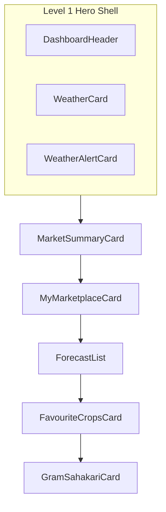
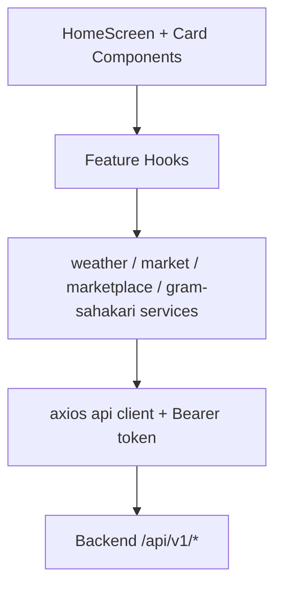

# Home Screen Module

> **Scope:** Kissan Agrisathi mobile Home feature (`Mobile App/src/features/home/`) plus Home-mounted cards from related features  
> **Audience:** Engineers joining or maintaining the Home tab  
> **Source of truth:** Current repository implementation (August 2026)  
> **Related docs:** [`profileScreen.md`](./profileScreen.md), [`mobile-app-documentation.md`](./mobile-app-documentation.md), [`backend-documentation.md`](./backend-documentation.md)

---

## Purpose

The Home screen is the farmer's daily dashboard — the first tab after login. It aggregates read-only summaries from weather, government market prices, marketplace activity, profile favourites, and village representative discovery into a single scrollable feed.

| Responsibility | Description |
|---|---|
| **Personalized greeting** | Time-aware Marathi greeting + farmer name + location from profile |
| **Today's weather** | Current conditions, stats, farming advice, and alerts for the farmer's district |
| **Market snapshot** | Top Agmarknet prices for profile favourite crops (excludes Milk) |
| **Marketplace activity** | Counts of active, sold, archived, and saved listings with deep links |
| **5-day forecast** | Horizontal glance of district forecast days |
| **Favourite crops** | Compact chips of all profile favourites (includes Milk) |
| **Village representative** | Local support contact discovery (`गाव प्रतिनिधी`) |

Home does **not** own profile editing, marketplace listing CRUD, or full market browsing — it surfaces summaries and navigates to dedicated tabs/screens.

---

## 1. Features

| Feature | Component / hook | Notes |
|---|---|---|
| Pull-to-refresh | `HomeScreen` | Refreshes all six data sources in parallel |
| Dashboard header | `DashboardHeader` | Brand logo, greeting, name, location hierarchy |
| Current weather | `WeatherCard` + `useCurrentWeather` | District-scoped via profile |
| Weather alerts | `WeatherAlertCard` + `useWeatherAlerts` | Compact OK bar or severity-styled alert list |
| Farming advice | `getFarmingAdvice` | Derived client-side from weather + alerts + forecast rain |
| Market prices | `MarketSummaryCard` + `useFavouriteMarketCards` | Shared store with Market tab; shows up to 4 crops, expandable |
| My Marketplace | `MyMarketplaceCard` + `useMyMarketplaceSummary` | Stat strip with navigation to filtered listings |
| 5-day forecast | `ForecastList` + `useForecast` | Horizontal scroll; first day marked as today |
| Favourite crops | `FavouriteCropsCard` | Read-only chips from profile favourites |
| Village representative | `GramSahakariCard` + `useGramSahakariRepresentative` | Call / WhatsApp actions; fallback tiers |
| Premium visual tiers | `home.theme.ts` | Level 1 Hero, Level 2 Primary, Level 3 Utility/Support |
| Marathi-first UI | `strings.home`, `weather.localization`, feature strings | English fallbacks in subtitles where noted |

**Not currently mounted on Home:** `ComingSoonGroup` (gov schemes + news placeholders) exists in the codebase but is not rendered by `HomeScreen`.

---

## 2. Folder Structure

```
Mobile App/src/features/home/
├── HomeScreen.tsx                  # Orchestrator — data hooks + card layout
├── home.theme.ts                   # Home-scoped colors, typography, surfaces, rhythm
├── home.service.ts                 # Placeholder mock summary (not used by HomeScreen)
├── home.mock.ts                    # Mock data for home.service
├── home.types.ts                   # HomeSummary types (future aggregate endpoint)
├── weather.service.ts              # HTTP: current, forecast, alerts
├── weather.types.ts                # DTOs mirroring backend weather responses
├── weather.utils.ts                # Icons, rain/humidity/UV labels, date formatting
├── weather.localization.ts         # Marathi conditions, greetings, farming advice
├── components/
│   ├── HomeBackground.tsx          # OrganicBackground + sand wash + top fade
│   ├── HomeHeroShell.tsx           # Unified hero card (header + weather zone)
│   ├── HomeSection.tsx             # Reusable section header (icon + title)
│   ├── DashboardHeader.tsx         # Greeting, name, location
│   ├── WeatherSection.tsx          # Spacing wrapper inside hero shell
│   ├── WeatherCard.tsx             # Current weather display
│   ├── WeatherAlertCard.tsx        # Alerts or compact "no alerts" bar
│   ├── WeatherSkeleton.tsx         # Loading skeletons for weather/forecast/alerts
│   ├── MarketSummaryCard.tsx       # Favourite crop prices (Level 1 market hero)
│   ├── MarketSummarySkeleton.tsx   # Market loading skeleton
│   ├── MyMarketplaceCard.tsx       # Marketplace activity summary (Level 2)
│   ├── ForecastList.tsx            # Forecast section header + horizontal list
│   ├── ForecastCard.tsx            # Single day forecast chip
│   ├── FavouriteCropsCard.tsx      # Favourite crop chips (Level 3 utility)
│   ├── ComingSoonGroup.tsx         # Gov + news placeholders (unused on Home)
│   └── PlaceholderCard.tsx         # Generic coming-soon card shell
└── hooks/
    ├── useCurrentWeather.ts
    ├── useForecast.ts
    └── useWeatherAlerts.ts

App route (thin re-export):
└── src/app/(tabs)/index.tsx        → HomeScreen

Related features mounted on Home (outside home/):
├── features/market/hooks/useFavouriteMarketCards.ts
├── features/marketplace/hooks/useMyMarketplaceSummary.ts
└── features/gram-sahakari/
    ├── components/GramSahakariCard.tsx
    ├── hooks/useGramSahakariRepresentative.ts
    ├── gram-sahakari.service.ts
    ├── gram-sahakari.strings.ts
    └── gram-sahakari.types.ts
```

### File responsibilities

| File | Responsibility |
|---|---|
| `HomeScreen.tsx` | Composes all cards; owns pull-to-refresh; derives `farmingAdvice` and location labels |
| `home.theme.ts` | Single source for Home visual tokens — does not affect other screens |
| `weather.service.ts` | Sole HTTP adapter for `/api/v1/weather/*` |
| `weather.localization.ts` | Marathi condition map, greetings, farmer advice rules |
| `useFavouriteMarketCards` | Shared profile + Agmarknet price store (Market + Home) |
| `useMyMarketplaceSummary` | Marketplace listing counts for Home card |
| `useGramSahakariRepresentative` | Village representative discovery for Home card |
| `GramSahakariCard` | UI for representative contact; uses `homeSurfaces.support` |

---

## 3. Screen Layout & Visual Hierarchy

Cards are ordered top-to-bottom in `HomeScreen` with intentional visual tiers:



| Tier | Surface token | Cards | Design intent |
|---|---|---|---|
| **Level 1 — Hero** | `homeSurfaces.heroShell`, `marketHero` | Header+weather shell, market prices | Highest visual weight; farmer's immediate context |
| **Level 2 — Primary** | `homeSurfaces.primary` | Marketplace summary, alert list (when active) | Actionable modules; moderate elevation |
| **Level 3 — Utility** | `homeSurfaces.utility`, `utilityOpen` | Forecast, favourites | Lighter, glanceable information |
| **Level 3 — Support** | `homeSurfaces.support` | Village representative | Warm accent; local help module |

Vertical spacing between sections uses `homeRhythm.block` (`spacing.md + 4`). Scroll content `paddingBottom` is `spacing.sm` (8px) to avoid empty space after the last card.
---

## 4. Architecture

### Layered flow



### Data flow

1. **HomeScreen** mounts and calls six independent hooks on render.
2. **Profile district** (from `useFavouriteMarketCards` → `useMyProfile`) gates weather hooks — no district means weather requests are skipped.
3. **Market cards** sync through `useFavouriteMarketStore` when profile favourites or district change.
4. **Farming advice** is computed client-side in HomeScreen from current weather, today's forecast rain chance, and alert presence.
5. **Pull-to-refresh** calls all six `refresh` functions in `Promise.all`.
6. Each card owns its loading, error, and empty states independently.

### Source of truth rules

| Concern | Source of truth |
|---|---|
| Farmer name / location / favourites | `GET /api/v1/profile/me` via `useMyProfile` (inside `useFavouriteMarketCards`) |
| Weather (current, forecast, alerts) | Backend weather APIs scoped to profile `district` |
| Market prices | Agmarknet-backed store shared with Market tab |
| Marketplace counts | `GET /api/v1/marketplace/my-summary` |
| Village representative | `GET /api/v1/gram-sahakari/representative` |
| Visual tokens | `home.theme.ts` (Home only) |
| Marathi weather conditions | `weather.localization.ts` |

There is **no** global Home store. Each hook holds local React state per mount.

---

## 5. APIs Used

All successful responses use the standard envelope:

```ts
type ApiSuccessResponse<T> = { success: true; data: T };
```

### 5.1 Weather

Every weather request requires `?district=<district>` from the farmer's profile. There is no client-side default district.

| Method | Endpoint | Purpose | Auth |
|---|---|---|---|
| `GET` | `/api/v1/weather/current?district=` | Current conditions | Required |
| `GET` | `/api/v1/weather/forecast?district=&days=7` | 7-day forecast (Home shows all returned days) | Required |
| `GET` | `/api/v1/weather/alerts?district=` | Government weather alerts | Required |

**Current weather DTO (`CurrentWeather`):**

```ts
{
  lastUpdated: string;
  temperatureC: number;
  condition: string;
  icon: string;
  humidity: number;
  windKph: number;
  windDirection: string;
  precipitationMm: number;
  cloud: number;
  uv: number;
  feelsLikeC: number;
}
```

**Forecast day DTO (`ForecastDay`):**

```ts
{
  date: string;
  maxTempC: number;
  minTempC: number;
  dailyChanceOfRain: number;
  avgHumidity: number;
  condition: string;
  icon: string;
}
```

**Weather alert DTO (`WeatherAlert`):**

```ts
{
  headline: string;
  severity: string;
  event: string;
  effective: string;
  expires: string;
  desc: string;
}
```

> **Important:** Frontend types use camelCase backend DTO fields (`temperatureC`, `windKph`). Never use raw WeatherAPI field names (`temp_c`, `wind_kph`) in UI code.

### 5.2 Market (favourite crop prices)

Home does not call market APIs directly. It consumes `useFavouriteMarketCards`, which:

1. Loads profile via `useMyProfile`.
2. Dedupes `favoriteCrops`; excludes Milk from Agmarknet cards via `excludeFromGovernmentMarket`.
3. Syncs `useFavouriteMarketStore` with district + crop dataset key.
4. Returns `pricedCards` (crops with valid prices) and `favoriteCrops` (all favourites for chips).

See Market module docs for Agmarknet endpoint details.

### 5.3 Marketplace summary

#### `GET /api/v1/marketplace/my-summary`

| Field | Value |
|---|---|
| **Method** | `GET` |
| **Purpose** | Counts for Home "My Marketplace" card |
| **Auth** | Required |
| **Response `data`** | `MyMarketplaceSummary` |

```ts
type MyMarketplaceSummary = {
  active: number;
  sold: number;
  archived: number;
  saved: number;
};
```

Tapping stat cells navigates to `/marketplace-my-listings` with optional `?status=` filter.

### 5.4 Village representative (Gram Sahakari)

#### `GET /api/v1/gram-sahakari/representative`

| Field | Value |
|---|---|
| **Method** | `GET` |
| **Purpose** | Discover nearest paid village representative |
| **Auth** | Required |
| **Response `data`** | `RepresentativeDiscovery` |

```ts
type RepresentativeDiscovery = {
  available: boolean;
  matchLevel: 'VILLAGE' | 'TALUKA' | 'DISTRICT' | null;
  representatives: RepresentativeContact[];
  profileComplete: boolean;
};

type RepresentativeContact = {
  name: string;
  phone: string;
  village: string;
  taluka: string;
  district: string;
  photoUrl: string | null;
};
```

**Match levels:**

| Level | Badge (Marathi) | UX |
|---|---|---|
| `VILLAGE` | गाव प्रतिनिधी | Direct local match |
| `TALUKA` | तालुका प्रतिनिधी | Fallback banner when no village rep |
| `DISTRICT` | जिल्हा प्रतिनिधी | Fallback when no village or taluka rep |

**Profile incomplete:** Card shows CTA to complete profile (`/complete-profile` or edit flow) when `profileComplete === false`.

### 5.5 Profile (indirect)

Home reads profile fields through `useFavouriteMarketCards`:

- `name`, `district`, `favoriteCrops`
- Location hierarchy: `location.village/taluka/district` with Marathi name preference

See [`profileScreen.md`](./profileScreen.md) for full profile API reference.

---

## 6. Hooks

### 6.1 `useCurrentWeather(district)`

| Aspect | Detail |
|---|---|
| **File** | `hooks/useCurrentWeather.ts` |
| **Input** | `district: string \| undefined` |
| **Outputs** | `{ data, loading, error, refresh }` |
| **Skip** | No fetch when `district` is undefined |
| **Soft refresh** | Keeps existing `data` visible; only sets `loading: true` when `data === null` |
| **Error** | `strings.home.weatherError` |

### 6.2 `useForecast(district)`

| Aspect | Detail |
|---|---|
| **File** | `hooks/useForecast.ts` |
| **Input** | `district: string \| undefined` |
| **Outputs** | `{ data: ForecastDay[], loading, error, refresh }` |
| **Error** | `strings.home.forecastError` |

### 6.3 `useWeatherAlerts(district)`

| Aspect | Detail |
|---|---|
| **File** | `hooks/useWeatherAlerts.ts` |
| **Input** | `district: string \| undefined` |
| **Outputs** | `{ data, loading, error, refresh }` |
| **Error** | `strings.home.alertsError` |

### 6.4 `useFavouriteMarketCards()` (market feature)

| Aspect | Detail |
|---|---|
| **File** | `features/market/hooks/useFavouriteMarketCards.ts` |
| **Outputs** | `pricedCards`, `favoriteCrops`, `profile`, `loading`, `settled`, `error`, `refresh`, … |
| **Shared store** | `useFavouriteMarketStore` — dedupes fetches across Market + Home |
| **Milk** | Included in `favoriteCrops`; excluded from `pricedCards` |

### 6.5 `useMyMarketplaceSummary()` (marketplace feature)

| Aspect | Detail |
|---|---|
| **File** | `features/marketplace/hooks/useMyMarketplaceSummary.ts` |
| **Outputs** | `{ data, loading, error, refresh }` |
| **Default** | `{ active: 0, sold: 0, archived: 0, saved: 0 }` |

### 6.6 `useGramSahakariRepresentative()` (gram-sahakari feature)

| Aspect | Detail |
|---|---|
| **File** | `features/gram-sahakari/hooks/useGramSahakariRepresentative.ts` |
| **Outputs** | `{ data, loading, error, refresh, silentRefresh }` |
| **silentRefresh** | Used by pull-to-refresh — does not flash loading skeleton |
---

## 7. Components

### 7.1 `HomeBackground`

Wraps shared `OrganicBackground` with Home-specific overlays:

- `baseWash` — sand tint at 22% opacity
- `topFade` — hero gradient top color, 280px height

Pointer events disabled on overlays.

### 7.2 `HomeHeroShell`

Unified Level 1 container for header + weather. Applies `homeSurfaces.heroShell`, gradient washes, and `BrandLeaves` decorative variant. Children laid out with `homeRhythm.heroInner` gap.

### 7.3 `DashboardHeader`

| Prop | Type | Notes |
|---|---|---|
| `name` | `string` | Farmer name; falls back to `strings.home.farmerFallback` |
| `village` | `string?` | Primary location line |
| `taluka` | `string?` | Secondary detail |
| `district` | `string?` | Secondary detail |

Uses `getGreetingByTime()` for time-aware Marathi greeting + emoji. Shows brand logo and `strings.app.name`.

### 7.4 `WeatherCard`

| Prop | Type | Notes |
|---|---|---|
| `weather` | `CurrentWeather` | Required when rendered |
| `todayRainChance` | `number?` | From forecast day 0 |
| `farmingAdvice` | `string?` | Appended in alert-free compact bar |
| `locationLabel` | `string?` | `village · taluka · district` joined string |

Displays large temperature, Marathi condition (`translateCondition`), weather icon, rain chip, stats grid (humidity, wind, UV, etc.), and last-updated time.

### 7.5 `WeatherAlertCard`

| Prop | Type | Notes |
|---|---|---|
| `alerts` | `WeatherAlert[] \| null` | `null` during initial load |
| `loading` | `boolean` | Shows `AlertSkeleton` when `loading && alerts === null` |
| `error` | `string \| null` | Retry row |
| `farmingAdvice` | `string?` | Shown in compact OK bar when no alerts |
| `onRetry` | `() => void` | |

**States:**

1. Loading skeleton
2. Error with retry
3. No alerts — green compact bar with check icon + farming advice
4. Active alerts — severity-colored items (extreme/severe, moderate, minor)

### 7.6 `MarketSummaryCard`

| Prop | Type | Notes |
|---|---|---|
| `pricedCards` | `MarketCropCardModel[]` | Crops with valid Agmarknet data |
| `favoriteCropsCount` | `number` | Total favourites (for empty-state messaging) |
| `loading` | `boolean` | Initial skeleton when not settled |
| `settled` | `boolean` | All market-eligible favourites finished loading |
| `error` | `string \| null` | Profile-level error when no priced cards |
| `onRetry` | `() => void` | |

**Row design:** Rank number, crop emoji circle, Marathi + English names, mandi with map marker, hero price (`₹` formatted), `/ क्विंटल`, Best badge, optional "today" freshness badge.

**Expand:** Shows first 4 crops; `LayoutAnimation` expand for remainder via `marketMoreCrops` / `marketShowLess` strings.

Uses `homeSurfaces.marketHero` with green accent bar.

### 7.7 `MyMarketplaceCard`

| Prop | Type | Notes |
|---|---|---|
| `summary` | `MyMarketplaceSummary` | |
| `loading` | `boolean` | |
| `error` | `string \| null` | |
| `onRetry` | `() => void` | |

**Stat tones (no red for saved):**

| Status | Icon | Accent |
|---|---|---|
| Active | `store-check-outline` | Green |
| Sold | `check-circle-outline` | Blue |
| Archived | `archive-outline` | Steel |
| Saved | `bookmark-outline` | Amber |

Header band shows total owned listings pill. Empty state with icon + CTA to marketplace tab. `viewAll` navigates to my listings.

### 7.8 `ForecastList` + `ForecastCard`

Horizontal 5–7 day glance. `ForecastCard` width 68px; today gets `todayMarker` and slightly larger icon.

Uses `formatDayShort` for Marathi weekday labels. `strings.home.forecast.today` for index 0.

### 7.9 `FavouriteCropsCard`

Read-only chips: emoji + Marathi crop name. Count badge in header. Empty/loading states prompt user to add favourites in profile.

Uses `homeSurfaces.utility`. Does **not** filter by market availability.

### 7.10 `GramSahakariCard` (गाव प्रतिनिधी)

| Prop | Type | Notes |
|---|---|---|
| `data` | `RepresentativeDiscovery` | |
| `loading` | `boolean` | Skeleton state |
| `error` | `string \| null` | |
| `onRetry` | `() => void` | |

**UI states:**

1. Loading skeleton
2. Error + retry
3. Profile incomplete — CTA to complete profile
4. No representative available — empty copy
5. Fallback (taluka/district) — banner + representative list
6. Village match — horizontal scroll of representative cards

Each representative card: avatar (photo or initial), name, location line, match badge, Call + WhatsApp actions via `Linking`.

Uses `homeSurfaces.support` + warm header (`supportHeader`). Compact layout — last card on Home scroll.

**Naming:** User-facing title is `गाव प्रतिनिधी` (`gramSahakariStrings.title`). "Gram Sahakari" is not shown in the app UI.

### 7.11 `HomeSection`

Reusable section header with icon pill and title/subtitle. Variants: `hero`, `primary`, `utility`. Used by some cards internally; forecast uses custom title row.

### 7.12 `ComingSoonGroup` (dormant)

Placeholder cards for government schemes and farming news. Present in codebase but **not imported** by current `HomeScreen`.

---

## 8. Design System (`home.theme.ts`)

### Colors (`homeColors`)

| Token | Usage |
|---|---|
| `heroGradientTop/Mid/Bottom` | Hero shell washes |
| `heroAccent`, `heroAccentSoft` | Temperature, chips, icon backgrounds |
| `marketAccentLine`, `marketPrice`, `marketMandi` | Market card accents |
| `supportWarm`, `supportBorder` | Village representative card |
| `sandInset`, `utilityMuted`, `divider` | Chips, forecast, subtle borders |
| `inkSoft`, `inkMuted` | Secondary text |

### Typography (`homeText`)

Devanagari-tuned sizes for `heroName`, `tempDisplay`, `priceHero`, `sectionHero/Primary/Utility`, `metricValue/Label`, etc.

### Surfaces (`homeSurfaces`)

| Token | Tier |
|---|---|
| `heroShell`, `weatherInner` | Level 1 hero |
| `marketHero`, `marketAccentBar` | Level 1 market |
| `primary` | Level 2 |
| `utility`, `utilityOpen` | Level 3 |
| `support`, `supportHeader` | Level 3 support |

### Rhythm (`homeRhythm`)

- `heroInner` — gap inside hero shell
- `block` — gap between major Home sections
- `utility` — gap inside utility sections

---

## 9. Farming Advice Logic

`getFarmingAdvice` in `weather.localization.ts` evaluates in priority order:

1. Active weather alerts → alert message
2. Extreme heat (> 38°C) or cold (< 10°C)
3. Thunderstorm / heavy rain conditions
4. High wind (≥ 40 kph)
5. Light/patchy rain from condition text
6. Sunny / clear / cloudy
7. Rain chance from forecast (≥ 50% likely, ≥ 20% possible)
8. Default: favorable

HomeScreen passes `hasAlerts: (alerts?.length ?? 0) > 0` and `rainChance` from `forecast[0].dailyChanceOfRain`.

---

## 10. Pull-to-Refresh

`HomeScreen.handleRefresh` sets `refreshing` true, then awaits:

```ts
Promise.all([
  refreshMarket(),
  refreshWeather(),
  refreshForecast(),
  refreshAlerts(),
  refreshMarketplaceSummary(),
  refreshGramSahakari(), // silentRefresh — no skeleton flash
]);
```

Each source refreshes independently; one failure does not block others.

---

## 11. Localization

### Strategy

- **Primary:** Marathi in `strings.home`, `weather.localization.ts`, `gramSahakariStrings`, `marketplaceStrings.homeSummary`
- **English:** Subtitles and parenthetical hints in crop/market empty states
- **Weather conditions:** Exact map + regex pattern fallbacks; unknown conditions shown in original English

### Key string groups

| Group | Location | Examples |
|---|---|---|
| Greetings | `strings.home.greetings` | सुप्रभात, शुभ दुपार |
| Weather labels | `strings.home.weather` | humidity, wind, UV advisories |
| Alerts | `strings.home.alerts` | title, noneTitle |
| Forecast | `strings.home.forecast` | title, weekdays, today |
| Market | `strings.home.market*` | title, no prices, expand/collapse |
| Crops | `strings.home.crops*` | title, empty, loading |
| Village rep | `gramSahakariStrings` | गाव प्रतिनिधी, call, WhatsApp |
| Marketplace | `marketplaceStrings.homeSummary` | stat labels, empty CTA |
---

## 12. Error Handling

| Scenario | Behaviour |
|---|---|
| Weather load fail (no cached data) | `WeatherErrorCard` inline in hero with retry |
| Weather load fail (has cached data) | Keeps showing last weather; soft refresh only |
| Forecast / alerts fail | Error row in section with retry button |
| Market profile error (no priced cards) | `MarketSummaryCard` error state + retry |
| Market no favourites | Prompt to add crops in profile |
| Market favourites but no prices | Marathi + English no-prices message |
| Marketplace summary fail | Error card with retry |
| Representative fail | Error state in `GramSahakariCard` |
| Profile incomplete for rep | CTA card — not treated as error |
| Pull-to-refresh partial fail | Other sections still update; no global error banner |

---

## 13. Constraints

| Constraint | Rationale |
|---|---|
| Weather scoped to profile district | Backend contract; no geolocation on Home |
| Milk excluded from market prices | No Agmarknet government price for dairy |
| Milk included in favourite chips | Profile favourite display is complete |
| No red for saved marketplace stat | UX decision — amber bookmark tone instead |
| Home theme scoped to `home.theme.ts` | Visual redesign must not leak to other tabs |
| Village rep branded as गाव प्रतिनिधी | Product naming — not "Gram Sahakari" in UI |
| Minimal bottom scroll padding | Last card should not leave large empty gap |
| DTO field names from backend | Never use raw WeatherAPI names in frontend |
| `home.service.ts` is unused | Legacy placeholder; HomeScreen uses per-feature services |

---

## 14. Related Modules

| Module | Used for |
|---|---|
| `features/profile` | Farmer name, district, location, favourite crops |
| `features/market` | Agmarknet prices, crop labels/emojis, favourite store |
| `features/marketplace` | Listing summary counts and navigation |
| `features/gram-sahakari` | Representative discovery card |
| `features/crop` | `excludeFromGovernmentMarket`, `getCropLabel` |
| `components/OrganicBackground` | Base agricultural background texture |
| `components/BrandLeaves` | Decorative leaves in hero shell |
| `constants/strings.ts` | `strings.home.*` |
| `theme` | Global palette, spacing, typography, elevation |

---

## 15. Developer Notes

1. **Add new Home cards at the bottom** of `ScrollView` unless they are hero-tier (weather/market).
2. **Use `homeSurfaces` and `homeText`** for new Home UI — do not import card styles from other tabs.
3. **Weather hooks need `district`** from profile — handle `undefined` while profile loads.
4. **Market data:** use `useFavouriteMarketCards` — do not duplicate Agmarknet fetches on Home.
5. **Farming advice:** call `getFarmingAdvice` in HomeScreen (or pass consistent inputs) — do not duplicate rules in cards.
6. **Pull-to-refresh:** add new data sources to `handleRefresh` `Promise.all`.
7. **Gram Sahakari refresh:** prefer `silentRefresh` on pull-to-refresh to avoid skeleton flash.
8. **Milk:** show in `FavouriteCropsCard`, never in `MarketSummaryCard` priced rows.
9. **Navigation from Home cards:** use `expo-router` `router.push` with typed `Href` — patterns exist in marketplace and gram-sahakari cards.
10. **Coming soon placeholders:** `ComingSoonGroup` is available but intentionally not mounted until features ship.

---

## 16. Testing Checklist

### Layout & visual

- [ ] Hero shell groups header + weather without double borders
- [ ] Market card accent bar and rank/price hierarchy readable
- [ ] Marketplace stats use green/blue/steel/amber — no red for saved
- [ ] Forecast horizontal scroll shows today marker on first day
- [ ] Favourite chips include Milk when in profile
- [ ] Village representative card titled गाव प्रतिनिधी
- [ ] No excessive empty space below last card when scrolled to end
- [ ] Pull-to-refresh spinner uses theme primary color

### Data & states

- [ ] New user with incomplete profile — weather waits for district
- [ ] Weather error shows retry; successful retry restores card
- [ ] No alerts shows compact green bar with farming advice
- [ ] Active alerts show severity styling
- [ ] Market: no favourites → profile prompt
- [ ] Market: favourites, no prices → no-prices message
- [ ] Market: expand/collapse for > 4 priced crops
- [ ] Marketplace: empty state CTA navigates correctly
- [ ] Marketplace: stat taps open filtered my-listings
- [ ] Representative: village / taluka / district fallback banners
- [ ] Representative: call and WhatsApp open correct URLs
- [ ] Profile incomplete → representative CTA to complete profile

### Refresh & regression

- [ ] Pull-to-refresh updates all sections
- [ ] Profile edit (name, location, crops) reflects on return to Home
- [ ] Market tab and Home show consistent prices (shared store)
- [ ] TypeScript `tsc --noEmit` clean for touched files

---

## 17. Future Improvements

(Not implemented — candidates only.)

| Idea | Benefit |
|---|---|
| Wire `home.service.ts` to real aggregate endpoint | Single request for Home bootstrap |
| Re-enable `ComingSoonGroup` when gov/news ship | Surface upcoming features |
| Shared React Query cache for weather + profile | Deduplicate network across tabs |
| Tap market row → Market tab crop detail | Deeper navigation from snapshot |
| Weather location from GPS fallback | When profile district missing |
| Skeleton harmony pass | Unified shimmer across all cards |
| Offline cached weather | Better rural connectivity UX |

---

## 18. Revision History

| Milestone | Summary |
|---|---|
| Initial Home placeholder | Static coming-soon screen |
| Weather integration | Current, forecast, alerts APIs + hooks |
| Market favourites on Home | Shared `useFavouriteMarketCards` store |
| Marketplace summary card | `useMyMarketplaceSummary` + navigation |
| Gram Sahakari / Village rep | Representative discovery card |
| `home.theme.ts` tier system | Hero / primary / utility / support surfaces |
| Premium card redesign | Market, marketplace, forecast, favourites, rep card polish |
| Village rep rename | UI shows गाव प्रतिनिधी; compact card layout |
| Marketplace color fix | Saved stat uses amber, not red |
| Bottom padding fix | Reduced `content.paddingBottom` to `spacing.sm` |
| Home documentation | This file |

---

## Appendix A — HomeScreen data wiring

```ts
// District gates weather
const district = profile?.district;
useCurrentWeather(district);
useForecast(district);
useWeatherAlerts(district);

// Farming advice (client-side)
const farmingAdvice = weather
  ? getFarmingAdvice({
      condition: weather.condition,
      temperatureC: weather.temperatureC,
      rainChance: forecast[0]?.dailyChanceOfRain,
      windKph: weather.windKph,
      hasAlerts: (alerts?.length ?? 0) > 0,
    })
  : undefined;

// Location label for weather card
const weatherLocationLabel = [village, taluka, districtLabel]
  .filter(Boolean)
  .join(' · ');
```

## Appendix B — Quick "where do I change X?"

| Change | Start here |
|---|---|
| Home card order / refresh list | `HomeScreen.tsx` |
| Home-only colors / surfaces | `home.theme.ts` |
| Weather API paths | `weather.service.ts` |
| Marathi weather conditions | `weather.localization.ts` |
| Farming advice rules | `weather.localization.ts` → `getFarmingAdvice` |
| Market row layout | `MarketSummaryCard.tsx` |
| Marketplace stat colors/icons | `MyMarketplaceCard.tsx` → `STAT_CONFIG` |
| Village rep copy | `gram-sahakari.strings.ts` |
| Village rep API | `gram-sahakari.service.ts` |
| Home Marathi strings | `constants/strings.ts` → `home` |
| Tab route entry | `src/app/(tabs)/index.tsx` |

---

*End of Home Screen technical reference.*
