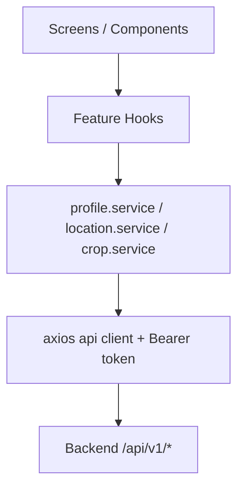
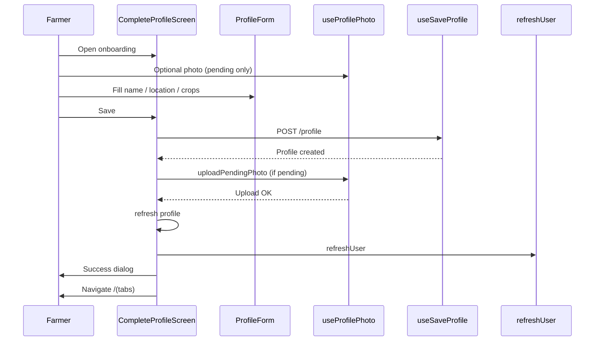
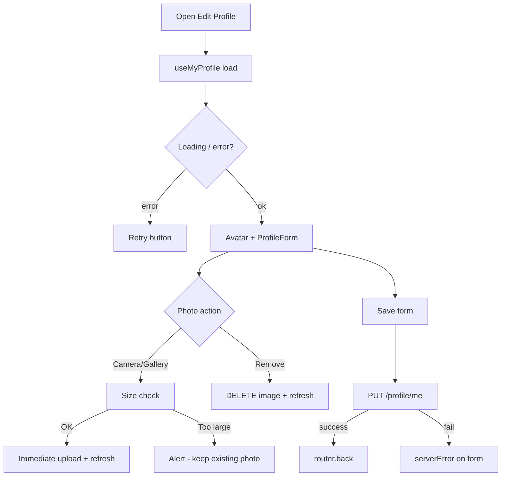

# Profile Module

> **Scope:** Kissan Agrisathi mobile Profile feature (`Mobile App/src/features/profile/`)  
> **Audience:** Engineers joining or maintaining the Profile module  
> **Source of truth:** Current repository implementation (July 2026)  
> **Related docs:** [`mobile-app-documentation.md`](./mobile-app-documentation.md), [`backend-documentation.md`](./backend-documentation.md)

---

## Purpose

The Profile module owns the farmer’s identity and personalization data inside the Kissan Agrisathi app. It is responsible for:

| Responsibility | Description |
|---|---|
| **First-time onboarding** | `CompleteProfileScreen` — create the farmer profile after OTP login |
| **Profile management** | View and edit name, location hierarchy, favourite crops |
| **Profile photo** | Optional camera/gallery upload, remove, retry, size validation |
| **District / Taluka / Village** | Cascading Location Master pickers (LGD codes + names) |
| **Favourite crops** | Multi-select via Crop Master (browse + search) |
| **User profile updates** | `PUT /api/v1/profile/me` from Edit Profile |
| **Avatar handling** | Shared `ProfileAvatar` + `useProfilePhoto` across onboarding, Profile tab, and Edit |

Without a completed profile (`user.isProfileCompleted === true`), auth guards keep the farmer on the Complete Profile screen. After a successful create, `refreshUser()` reloads `GET /api/v1/auth/me` so the app can enter the main tab stack.

---

## 1. Features

| Feature | Screen / entry | Notes |
|---|---|---|
| Complete Profile onboarding | `(auth)/complete-profile` | Atomic create → optional deferred photo → refresh → Home |
| Edit Profile | `/edit-profile` | Shared form + immediate photo upload |
| View Profile | `(tabs)/profile` | Avatar, location, crops, phone, edit, logout |
| Upload profile photo | Shared hook | Camera or gallery; optional on onboarding |
| Remove profile photo | Shared hook | Remote DELETE; local pending clear on onboarding |
| Camera | `expo-image-picker` | Permission prompt → Settings deep-link if denied |
| Gallery | `expo-image-picker` | Single image; same size gate as camera |
| Favourite crops | `CropMultiSelect` | Max 10; Marathi recommended list + search |
| District selection | `LocationSelect` + `useDistricts` | From Location Master API |
| Taluka selection | Cascading | Depends on selected district code |
| Village selection | Cascading | Depends on selected taluka; shows `nameMr` subtitle |
| Logout | Profile tab | Confirm dialog → clear token → auth stack |
| Marathi-first UI | Strings modules | Primary copy in Marathi; English fallbacks where noted |

---

## 2. Folder Structure

```
Mobile App/src/features/profile/
├── ProfileScreen.tsx                 # Profile tab UI
├── profile.service.ts                # HTTP: CRUD + image
├── profile.types.ts                  # DTOs aligned with backend
├── profile.strings.ts                # Marathi photo / crop / label copy
├── profile.constants.ts              # MAX_PROFILE_IMAGE_SIZE_BYTES
├── profile.imageValidation.ts        # Shared ≤ 5 MB gate
├── components/
│   ├── ProfileForm.tsx               # Shared create/edit form
│   ├── ProfileAvatar.tsx             # Circular avatar control
│   ├── ProfilePhotoSection.tsx       # Onboarding photo block + copy
│   └── CropMultiSelect.tsx           # Favourite crops modal
├── hooks/
│   ├── useMyProfile.ts               # GET /profile/me
│   ├── useSaveProfile.ts             # POST /profile
│   ├── useUpdateProfile.ts           # PUT /profile/me
│   ├── useProfilePhoto.ts            # Camera / gallery / upload / pending
│   └── useDebouncedValue.ts          # Crop search debounce (200 ms)
└── screens/
    ├── CompleteProfileScreen.tsx     # Onboarding
    └── EditProfileScreen.tsx         # Edit

App routes (thin re-exports):
├── src/app/(tabs)/profile.tsx
├── src/app/(auth)/complete-profile.tsx
└── src/app/edit-profile.tsx
```

### File responsibilities

| File | Responsibility |
|---|---|
| `profile.service.ts` | Sole HTTP adapter for profile endpoints |
| `profile.types.ts` | Request/response TypeScript contracts |
| `profile.strings.ts` | Feature-local Marathi strings (photo, crops, labels) |
| `profile.constants.ts` | `MAX_PROFILE_IMAGE_SIZE_BYTES = 5 * 1024 * 1024` |
| `profile.imageValidation.ts` | `isProfileImageWithinSizeLimit()` — single size check |
| `useMyProfile` | Fetch/refresh authenticated farmer profile |
| `useSaveProfile` | Create profile during onboarding |
| `useUpdateProfile` | Partial update from Edit Profile |
| `useProfilePhoto` | **Only** upload/remove/pending-photo implementation |
| `ProfileForm` | Shared fields + client validation + Location/Crop masters |
| `ProfileAvatar` | Visual avatar (image / initial / camera badge) |
| `ProfilePhotoSection` | Onboarding wrapper around avatar + optional copy |
| `CropMultiSelect` | Crop Master browse + search multi-select |
| `CompleteProfileScreen` | Atomic onboarding orchestration |
| `EditProfileScreen` | Edit form + immediate photo mode |
| `ProfileScreen` | Read-only summary + photo actions + logout |

### Related modules (not under `profile/`)

| Module | Used for |
|---|---|
| `features/location/*` | Districts, talukas, villages, `LocationSelect` |
| `features/crop/*` | Crop list, search, `getCropLabel`, `resolveFavoriteCrops` |
| `features/auth/*` | `useAuth().refreshUser`, logout, `isProfileCompleted` |
| `constants/strings.ts` | `completeProfile.*`, `profile.*` onboarding/edit copy |
| `constants/language.ts` | `DEFAULT_LANGUAGE`, `MAX_FAVOURITE_CROPS`, `SupportedLanguage` |

---

## 3. Architecture

### Layered flow



### Data flow (simplified)

1. **UI** collects farmer input (`ProfileForm`, avatar tap).
2. **Hooks** own loading/error state and call services.
3. **Services** map TypeScript DTOs ↔ HTTP.
4. **API client** attaches `Authorization: Bearer <JWT>` for profile routes.
5. **Backend** validates, persists (MongoDB / Cloudinary for images), returns envelope `{ success, data }`.
6. **Refresh** (`useMyProfile.refresh` and/or `refreshUser`) brings local UI in sync.

### Source of truth rules

| Concern | Source of truth |
|---|---|
| Profile fields | Backend profile document via `GET /api/v1/profile/me` |
| Auth completion flag | `GET /api/v1/auth/me` → `user.isProfileCompleted` |
| Districts / talukas / villages | Location Master APIs (not hardcoded) |
| Crop catalogue | Crop Master APIs (not hardcoded) |
| Photo upload/remove | **Only** `useProfilePhoto` → `profile.service` image endpoints |
| Image size limit | Shared `isProfileImageWithinSizeLimit` + `MAX_PROFILE_IMAGE_SIZE_BYTES` |

There is **no** global Zustand/Redux profile store. Each screen that needs profile data calls `useMyProfile()` (local React state per mount). Focus effects re-fetch on Profile and Edit screens.

---

## 4. APIs Used

All successful responses use:

```ts
type ApiSuccessResponse<T> = {
  success: true;
  data: T;
};
```

### 4.1 Profile

#### `GET /api/v1/profile/me`

| Field | Value |
|---|---|
| **Method** | `GET` |
| **Purpose** | Load authenticated farmer profile |
| **Auth** | Required (Bearer JWT) |
| **Request** | None |
| **Response `data`** | `ProfileResponseDTO` |

Example response:

```json
{
  "success": true,
  "data": {
    "userId": "66f1a2b3c4d5e6f7a8b9c0d1",
    "name": "ओजस",
    "district": "Nashik",
    "taluka": "Igatpuri",
    "village": "Adwan",
    "location": {
      "district": { "code": 517, "name": "Nashik" },
      "taluka": { "code": 4201, "name": "Igatpuri" },
      "village": { "code": 551234, "name": "Adwan", "nameMr": "अडवण" }
    },
    "favoriteCrops": ["Onion", "Soyabean"],
    "language": "mr",
    "profileImage": { "url": "https://res.cloudinary.com/.../profile.jpg", "publicId": "..." },
    "createdAt": "2026-07-28T10:00:00.000Z",
    "updatedAt": "2026-07-28T10:05:00.000Z"
  }
}
```

#### `POST /api/v1/profile`

| Field | Value |
|---|---|
| **Method** | `POST` |
| **Purpose** | Create profile; backend sets `isProfileCompleted = true` |
| **Auth** | Required |
| **Request body** | `CreateProfileBody` |

```json
{
  "name": "ओजस",
  "district": "Nashik",
  "taluka": "Igatpuri",
  "village": "Adwan",
  "districtCode": 517,
  "talukaCode": 4201,
  "villageCode": 551234,
  "favoriteCrops": ["Onion", "Soyabean"],
  "language": "mr"
}
```

| Field | Value |
|---|---|
| **Response `data`** | `ProfileResponseDTO` |

> **Note:** Create body does **not** include a photo URL. Photos are uploaded separately via `POST /profile/image` after the profile exists.

#### `PUT /api/v1/profile/me`

| Field | Value |
|---|---|
| **Method** | `PUT` |
| **Purpose** | Partial update (at least one field) |
| **Auth** | Required |
| **Request body** | `UpdateProfileBody` = `Partial<CreateProfileBody>` |
| **Response `data`** | `ProfileResponseDTO` |

#### `POST /api/v1/profile/image`

| Field | Value |
|---|---|
| **Method** | `POST` |
| **Purpose** | Upload / replace profile photo (Cloudinary) |
| **Auth** | Required |
| **Content-Type** | `multipart/form-data` |
| **Field name** | `image` |
| **Response `data`** | `{ profileImage: { url, publicId } }` |

Client helper returns `profileImage` only:

```ts
uploadProfileImage(uri, fileName, mimeType): Promise<ProfileImage>
```

#### `DELETE /api/v1/profile/image`

| Field | Value |
|---|---|
| **Method** | `DELETE` |
| **Purpose** | Remove Cloudinary image and clear `profileImage` |
| **Auth** | Required |
| **Response `data`** | `null` |

---

### 4.2 Location Master (ProfileForm)

| Method | Endpoint | Purpose | Auth |
|---|---|---|---|
| `GET` | `/api/v1/location/districts` | List Maharashtra districts | Public read |
| `GET` | `/api/v1/location/talukas/:districtCode` | Talukas for a district | Public read |
| `GET` | `/api/v1/location/villages/:talukaCode` | Villages for a taluka | Public read |

**Village item shape (mobile):**

```ts
{ code: number; name: string; nameMr: string; category: string; status: string }
```

---

### 4.3 Crop Master (CropMultiSelect / labels)

| Method | Endpoint | Purpose | Auth |
|---|---|---|---|
| `GET` | `/api/v1/crops` | Full crop list | Public read |
| `GET` | `/api/v1/crops/search?q=&limit=` | Ranked search (EN/MR/aliases) | Public read |

**Crop item:**

```ts
{ cropId: number; name: string; nameMr: string }
```

Canonical English `name` values are what the profile stores in `favoriteCrops`.

**Special favourite — Milk (दूध):** Injected by the Crop service (`crop.special.ts`) as the **last** browse option (not part of Agmarknet `crop-master.json`). Search aliases: `milk`, `dairy`, `दूध`, `दुध`. Stored like any other favourite (`"Milk"`). Used by Farmer Expected Price; **excluded** from Government Market Prices.

---

### 4.4 Auth (onboarding completion)

| Method | Endpoint | Purpose | Auth |
|---|---|---|---|
| `GET` | `/api/v1/auth/me` | Refresh `isProfileCompleted` after create | Required |

Called via `useAuth().refreshUser()` in Complete Profile after create (+ optional photo) succeeds.

---

## 5. Shared Hooks

### 5.1 `useMyProfile`

| Aspect | Detail |
|---|---|
| **File** | `hooks/useMyProfile.ts` |
| **Responsibility** | Load and refresh `GET /api/v1/profile/me` |
| **Inputs** | None |
| **Outputs** | `{ data, loading, error, refresh }` |

**Lifecycle**

- On mount: `refresh()` runs; `loading` starts `true`.
- Later `refresh()` calls do **not** flip `loading` back to `true` (avoids full-screen flash during photo upload / focus sync).
- Errors: `getErrorMessage(err, 'Unable to load profile.')`.

**Consumers:** Profile tab, Edit Profile, Complete Profile, Home (district for weather).

---

### 5.2 `useSaveProfile`

| Aspect | Detail |
|---|---|
| **File** | `hooks/useSaveProfile.ts` |
| **Responsibility** | `POST /api/v1/profile` |
| **Outputs** | `{ saving, error, saveProfile(body) → ProfileResponseDTO \| null }` |

On failure: sets `error`, returns `null`. Does not navigate.

---

### 5.3 `useUpdateProfile`

| Aspect | Detail |
|---|---|
| **File** | `hooks/useUpdateProfile.ts` |
| **Responsibility** | `PUT /api/v1/profile/me` |
| **Outputs** | `{ updating, error, updateProfile(body) → ProfileResponseDTO \| null }` |

Edit Profile navigates `router.back()` only when result is non-null.

---

### 5.4 `useProfilePhoto` (critical shared hook)

| Aspect | Detail |
|---|---|
| **File** | `hooks/useProfilePhoto.ts` |
| **Responsibility** | Camera / gallery / size validation / upload / delete / pending photo |
| **Inputs** | See table below |
| **Outputs** | See table below |

**Options**

| Option | Type | Default | Meaning |
|---|---|---|---|
| `profileImage` | `ProfileImage \| null \| undefined` | — | Current remote image |
| `refreshProfile` | `() => Promise<void>` | — | Usually `useMyProfile().refresh` |
| `canUploadNow` | `boolean` | `true` | Immediate upload vs deferred pending |

**Return values**

| Field | Meaning |
|---|---|
| `displayUri` | `previewUri ?? profileImage?.url ?? null` |
| `hasRemoteImage` | Remote URL present |
| `hasPendingPhoto` | Local pending asset awaiting upload |
| `isUploadingPhoto` / `isBusy` | Upload or delete in progress |
| `uploadError` | Last client-side / upload error string |
| `uploadPendingPhoto()` | Upload pending asset via same path as immediate upload |
| `showPhotoActions()` | Platform action sheet / alert |

**Modes**

| Mode | Used by | Behavior |
|---|---|---|
| `canUploadNow: true` | Profile tab, Edit Profile | Selection → size check → upload → refresh |
| `canUploadNow: false` | Complete Profile | Selection → size check → store pending only |

**Error / permission handling**

- Camera / gallery permission denied → alert with Open Settings.
- Size exceeded → alert; **no** pending store, **no** API call.
- Upload failure → alert; pending asset kept for retry (onboarding).
- Delete failure → alert.

---

### 5.5 `useDebouncedValue`

Used by `CropMultiSelect` with **200 ms** delay so search does not fire on every keystroke.

---

### 5.6 Location / crop hooks (consumed by profile UI)

| Hook | Idle when | Loads |
|---|---|---|
| `useDistricts()` | — | All districts on mount |
| `useTalukas(districtCode)` | `districtCode` null | Talukas for district |
| `useVillages(talukaCode)` | `talukaCode` null | Villages for taluka |
| `useCrops()` | — | Full crop list |
| `useCropSearch(query)` | empty query | Search results |

---

## 6. Components

### 6.1 `ProfileAvatar`

**Purpose:** Large circular avatar control. Shows Cloudinary/local image, first letter of name, or account icon. Camera badge overlay. Pulse animation when empty. Upload overlay with spinner.

| Prop | Type | Notes |
|---|---|---|
| `name` | `string` | Initial letter when no image |
| `imageUri` | `string \| null` | Remote or local preview |
| `uploading` | `boolean?` | Shows overlay |
| `disabled` | `boolean?` | Blocks press |
| `onPress` | `() => void` | Opens photo actions |

Touch target ≥ 48 dp.

---

### 6.2 `ProfilePhotoSection`

**Purpose:** Onboarding-only presentation around `ProfileAvatar`.

Shows:

- Avatar
- Title: प्रोफाइल फोटो
- Optional badge: (ऐच्छिक)
- Tap-to-upload hint when empty
- Helper: तुम्ही हा नंतरही बदलू शकता.

Props mirror `ProfileAvatar` (`name`, `imageUri`, `uploading`, `disabled`, `onPress`).

---

### 6.3 `ProfileForm`

**Purpose:** Shared Name / District / Taluka / Village / Crops form for Complete + Edit.

| Prop | Type |
|---|---|
| `initialValues?` | `ProfileFormInitialValues` |
| `submitting` | `boolean` |
| `submitLabel` / `submittingLabel` | `string` |
| `serverError?` | `string \| null` |
| `onNameChange?` | `(value: string) => void` |
| `onSubmit` | `(values: ProfileFormValues) => void` |

**Submit payload (`ProfileFormValues`):**

```ts
{
  name: string;
  district: string;
  taluka: string;
  village: string;
  districtCode: number;
  talukaCode: number;
  villageCode: number;
  favoriteCrops: string[];
  language: SupportedLanguage; // always DEFAULT_LANGUAGE ('mr')
}
```

**Hydration:** Prefers LGD codes from `initialValues.location`, then name match. Favourite crops are resolved through `resolveFavoriteCrops()` for legacy labels.

**Cascade:** Changing district clears taluka + village. Changing taluka clears village.

---

### 6.4 `CropMultiSelect`

| Prop | Type |
|---|---|
| `label` | `string` |
| `helperText?` | `string` |
| `selected` | `string[]` (canonical English names) |
| `onChange` | `(next: string[]) => void` |
| `max` | `number` (`MAX_FAVOURITE_CROPS` = 10) |
| `error?` | `string` |
| `disabled?` | `boolean` |

Browse section lists crops with non-empty `nameMr`. Search uses backend ranking. Max selection shows a Snackbar.

---

### 6.5 `LocationSelect` (location feature)

Code + name picker with optional search (English name + Marathi subtitle). Used three times in `ProfileForm` for district / taluka / village.

---

## 7. State Management

### Profile cache model

- **No global profile cache.** `useMyProfile` holds React state **per screen instance**.
- Location/crop services may keep **module-level** in-memory caches (survive remounts within the JS session).

### Refresh APIs

| Function | What it refreshes |
|---|---|
| `useMyProfile().refresh()` | Farmer profile document (`profileImage`, location, crops, …) |
| `useAuth().refreshUser()` | Auth user (`isProfileCompleted`, mobile, …) |

### Onboarding refresh order (required)

```
Create profile
  → Upload pending photo (if any)
  → refresh()          // GET /profile/me
  → refreshUser()      // GET /auth/me
  → Success dialog
  → Navigate Home
```

Navigation must not run before both refreshes are awaited. Auth routing depends on `isProfileCompleted` from `refreshUser()`.

### Cache invalidation after photo

Immediate mode (`canUploadNow: true`): after successful upload/delete, `refreshProfile()` runs inside `useProfilePhoto`.

Deferred mode: pending upload also calls `refreshProfile()` after success; Complete Profile then refreshes again in `completeAndTransition()`.

### Focus refresh

Profile tab and Edit Profile call `refresh()` in `useFocusEffect` so returning from Edit or after backgrounding shows fresh data.

---

## 8. Complete Profile Flow

### Happy path



### Why photo upload happens AFTER profile creation

1. Image endpoint attaches the file to an **existing** profile / user document.
2. Create payload has **no** image field (schema constraint — do not change).
3. Deferred pending upload keeps photo optional and avoids blocking create on Cloudinary.
4. Shared upload path stays identical to Edit Profile (`uploadSelectedAsset`).

### Stages (UI progress dialog)

| Stage | Marathi copy key |
|---|---|
| `creating` | `creatingStep` — प्रोफाइल तयार करत आहे... |
| `uploading` | `uploadingStep` — फोटो अपलोड करत आहे... |
| `refreshing` | `refreshingStep` — माहिती अद्ययावत करत आहे... |
| `done` | `doneStep` — पूर्ण झाले |

Multiple Save taps are blocked while `submitting || isBusy`.

### Photo upload failure after create

Profile already exists. Dialog:

- **Title:** प्रोफाइल तयार झाले  
- **Message:** Profile created; photo failed; can upload later  
- **Retry:** `uploadPendingPhoto` again → refresh → success → Home  
- **Skip:** refresh → success → Home (generated avatar until later upload)

Farmer must never be stuck on a dead-end screen.

---

## 9. Edit Profile Flow



| Behavior | Detail |
|---|---|
| Photo | Immediate (`canUploadNow: true`) — independent of Save |
| Form Save | Updates text fields / location / crops only |
| Cancel | System back / leave screen (no explicit Cancel button) |
| Refresh | On focus + after photo operations |

---

## 10. Profile Photo System

### Shared implementation (single path)

```
showPhotoActions
  → camera | gallery
  → rejectIfImageTooLarge (shared)
  → canUploadNow ?
        true  → uploadSelectedAsset
        false → setPendingAsset
  → uploadPendingPhoto → uploadSelectedAsset  (retry / onboarding commit)
```

`uploadSelectedAsset` always:

1. Size validation  
2. `POST /api/v1/profile/image`  
3. `refreshProfile()`  
4. Clear pending / preview on success  

### Pending upload

| Concept | Detail |
|---|---|
| Storage | `pendingAssetRef` + local `previewUri` |
| When set | Onboarding pick with `canUploadNow: false` |
| When cleared | Successful upload, or remove pending, or oversized reject (never set) |
| Retry | Same `uploadSelectedAsset` |

### Remove

| Context | Behavior |
|---|---|
| Remote image exists | `DELETE /api/v1/profile/image` + refresh |
| Onboarding pending only | Clear local pending/preview; no DELETE |

### No duplicate upload logic

Screens must **not** call `uploadProfileImage` directly. Always go through `useProfilePhoto`.

---

## 11. Validation

### Form fields (`ProfileForm.validate`)

| Field | Rule | Message (Marathi via `strings.completeProfile`) |
|---|---|---|
| Name | Non-empty after trim | नाव आवश्यक आहे |
| District | Option selected | जिल्हा निवडणे आवश्यक आहे |
| Taluka | Option selected | तालुका निवडणे आवश्यक आहे |
| Village | Option selected | गाव निवडणे आवश्यक आहे |
| Favourite crops | At least 1 | किमान एक आवडते पीक निवडा |
| Favourite crops max | ≤ 10 | Snackbar: जास्तीत जास्त १० पिके निवडू शकता |

Submit also disabled while location lists are loading or districts failed to load.

### Phone

Phone is **not** edited on Profile forms. It comes from auth (`user.mobile`) and is displayed on the Profile tab only.

### Image validation

| Rule | Implementation |
|---|---|
| Max size | `MAX_PROFILE_IMAGE_SIZE_BYTES = 5 * 1024 * 1024` |
| Comparator | `fileSize <= MAX` allowed; `>` rejected |
| Missing `fileSize` | Allowed (no crash) |
| Shared helper | `isProfileImageWithinSizeLimit` |
| Gate site | `rejectIfImageTooLarge` inside `useProfilePhoto` |

**Oversized image behaviour**

- Alert: Marathi title + English fallback body  
- No upload API  
- No pending asset  
- Existing remote photo unchanged (Edit / Profile)  
- Onboarding can still Save without a photo  

Backend also enforces 5 MB / MIME types; client size gate reduces wasted uploads.

---

## 12. Constraints

| Constraint | Rationale |
|---|---|
| Max image size 5 MB | Shared constant; client + server aligned |
| Single upload implementation | `useProfilePhoto` only |
| Shared refresh after upload | Avoids stale avatars |
| No hardcoded districts/crops | Location Master + Crop Master |
| Marathi-first UI | Farmer audience in Maharashtra |
| Atomic onboarding | Create → photo → refresh profile → refresh user → navigate |
| Create body has no photo field | Schema / API must not be changed for this feature |
| US spelling `favoriteCrops` | Matches backend |
| Language submitted as `mr` | `DEFAULT_LANGUAGE`; no language picker on form yet |
| Do not modify Website Frontend | Separate product surface |

---

## 13. Error Handling

| Scenario | Behaviour |
|---|---|
| Network / 500 on create | Form `serverError`; stay on Complete Profile |
| Network / 500 on update | Form `serverError`; stay on Edit |
| Profile load fail (tab) | Error card + Retry |
| Profile load fail (edit) | Centered message + Retry |
| Image upload fail (immediate) | Alert; preview/pending may remain for retry |
| Image upload fail after create | Retry / Skip dialog (non-blocking for profile existence) |
| Size validation fail | Alert; no network |
| Camera / gallery permission denied | Alert → Open Settings |
| Image picker cancel | No-op |
| Crop list/search fail | In-modal error + Retry |
| Location list fail | `loadError` + Retry on `LocationSelect` |
| Logout | Confirm dialog; then clear session |

---

## 14. Localization

### Strategy

- **Primary:** Marathi in `profile.strings.ts` and `strings.completeProfile` / `strings.profile`
- **English fallback:** Used for some technical alerts (e.g. image size English line; some load-error fallbacks)
- Form language field is always submitted as `'mr'` (`DEFAULT_LANGUAGE`)

### Key string groups

| Group | Location | Examples |
|---|---|---|
| Onboarding header / stages | `constants/strings.ts` → `completeProfile` | welcome, creatingStep, successTitle |
| Photo actions | `profile.strings.ts` → `photo` | takePhoto, sizeExceeded, uploading |
| Crop picker | `profile.strings.ts` → `crops` | helper, maxReached, searchPlaceholder |
| Profile tab labels | `profile.strings.ts` → `labels` | जिल्हा, तालुका, गाव |
| Logout | `constants/strings.ts` → `profile` | logoutConfirmTitle |

### Image size messages

| Locale | Text |
|---|---|
| Marathi | फोटोचा आकार ५ MB पेक्षा कमी असावा. |
| English | Image size must be less than 5 MB. |

---

## 15. Security

| Topic | Behaviour |
|---|---|
| Authenticated profile APIs | Bearer JWT via axios defaults |
| Profile ownership | Backend scopes `/me` and image routes to authenticated user |
| Image upload auth | Same JWT; multipart post |
| Location / crop reads | Public master data (no PII) |
| Token storage | Auth module SecureStore / storage layer (outside Profile) |
| Logout | Deletes token, clears auth header, resets user |

Never log JWTs or image binary payloads in production code.

---

## 16. Performance

| Practice | Detail |
|---|---|
| Shared hooks | One photo path; one form |
| Avoid duplicate uploads | Pending + busyRef guards |
| Soft refresh | `useMyProfile.refresh` avoids loading flicker after first load |
| Location/crop module caches | Reduce repeat master fetches |
| Crop search debounce | 200 ms |
| FlatList windowing | Crop / location modals use `initialNumToRender` / `windowSize` |
| Refresh order | Profile then auth — prevents Home opening with incomplete auth flag |

**Caveat:** Each screen mounts its own `useMyProfile` instance (no shared React Query cache). Focus refreshes are intentional for correctness over minimizing network.

---

## 17. Production Decisions

### Why onboarding upload is deferred

Profile create and image upload are separate backend contracts. Uploading before create fails or is undefined. Pending local selection preserves UX without inventing a new API.

### Why a shared upload hook exists

Camera, gallery, retry, remove, size checks, and Cloudinary multipart must stay identical across three screens. Duplication previously caused onboarding photo persistence bugs.

### Why refresh order matters

`refreshUser()` flips `isProfileCompleted`, which unlocks the main app stack. Refreshing profile alone is not enough for routing. Refreshing auth before profile can still show a stale avatar briefly; both are awaited before success navigation.

### Why pending upload exists

Lets farmers pick a photo early, fill a long form, then commit the image once the profile row exists — without blocking Save on Cloudinary when skipped.

### Why image validation is shared

One constant and one helper prevent screens from diverging (e.g. Edit allowing 6 MB while onboarding rejects it).

### Why 5 MB limit exists

Balances Cloudinary cost/bandwidth with farmer device photos. Matches backend multer limit.

---

## 18. Future Improvements

(Not implemented — candidates only.)

| Idea | Benefit |
|---|---|
| Client-side compression before upload | Fewer size rejections; faster uploads |
| Upload progress % | Clearer feedback on slow networks |
| Image cropping / square aspect | Consistent avatars |
| Disk / memory avatar cache | Faster Profile tab paint |
| Offline queue for photo | Better rural connectivity UX |
| Optimistic avatar updates with rollback | Snappier Edit Profile |
| Shared profile query cache (React Query) | Deduplicate `GET /me` across tabs |
| Explicit Cancel on Edit | Clearer UX |
| MIME pre-check on client | Fail faster before multipart |

---

## 19. Developer Notes

1. **Never duplicate upload logic.** Use `useProfilePhoto` only.  
2. **Never bypass shared hooks** for create/update/fetch — use `useSaveProfile` / `useUpdateProfile` / `useMyProfile`.  
3. **Always refresh after successful upload/delete** via `refreshProfile` passed into the photo hook.  
4. **Onboarding:** after create, always `refresh()` then `refreshUser()` before navigating.  
5. **Always use Location Master** — never hardcode Maharashtra districts/talukas/villages.  
6. **Always use Crop Master** — never hardcode crop lists (exception: Milk is injected by backend Crop service as a special favourite — do not invent a Dairy module).  
7. **Store canonical English crop `name`** in `favoriteCrops`; display with `getCropLabel` / `nameMr`. Milk stores as `"Milk"`.  
8. **Never upload images larger than 5 MB** — enforce via `MAX_PROFILE_IMAGE_SIZE_BYTES`.  
9. **Do not add photo fields to `CreateProfileBody`** without an explicit API/schema change.  
10. **Do not modify Website Frontend** for mobile Profile work.  
11. Prefer LGD **codes** in payloads; keep names for compatibility.  
12. Keep spelling **`favoriteCrops`** (US) everywhere.

---

## 20. Testing Checklist

### Onboarding (Complete Profile)

- [ ] New user lands on Complete Profile after OTP  
- [ ] Welcome / progress / Marathi copy renders  
- [ ] Skip photo → Save → Home → generated avatar  
- [ ] Camera photo ≤ 5 MB → pending preview → Save → photo on Profile/Home  
- [ ] Gallery photo ≤ 5 MB → same  
- [ ] Photo > 5 MB → alert; no pending; Save without photo still works  
- [ ] Exactly 5 MB → allowed  
- [ ] Missing `fileSize` → no crash  
- [ ] Remove pending photo before Save  
- [ ] Validation: empty name / location / crops blocked  
- [ ] Create succeeds, upload fails → Retry succeeds → Home has photo  
- [ ] Create succeeds, upload fails → Skip → Home generated avatar; later Profile upload works  
- [ ] Progress stages show during Save  
- [ ] Double-tap Save does not double-create  

### Edit Profile

- [ ] Loads existing data (codes hydrate location)  
- [ ] Change village / crops / name → Save → Profile reflects changes  
- [ ] Immediate photo upload updates avatar without Save  
- [ ] Remove photo → avatar falls back to initial  
- [ ] Oversized image rejected; previous photo remains  
- [ ] Update failure shows error; stays on screen  

### Profile Screen

- [ ] Avatar / name / district / taluka / village / crops / phone  
- [ ] Edit Profile navigation  
- [ ] Logout confirm → auth stack  
- [ ] Focus refresh after Edit  

### Permissions & network

- [ ] Camera denied → Settings prompt  
- [ ] Gallery denied → Settings prompt  
- [ ] Offline create → error, no navigation  
- [ ] Offline upload → retry/skip paths  
- [ ] Slow network → loading states; no freeze  

### Persistence

- [ ] App restart → uploaded photo still visible  
- [ ] Favourite crops survive restart  

### Regression

- [ ] Home weather still uses profile district  
- [ ] TypeScript `tsc --noEmit` clean for touched files  

---

## 21. Revision History

| Milestone | Summary |
|---|---|
| Initial Profile module | View / edit / complete profile with basic form |
| Location Master integration | Replaced hardcoded districts; cascading taluka/village APIs |
| Crop Master integration | Favourite crops via `/crops` + `/crops/search` |
| Milk (दूध) special favourite | Injected last in crop list; search milk/dairy/दूध; Farmer Expected Price only — excluded from Government Market |
| Marathi localization | Profile + onboarding + photo/crop strings Marathi-first |
| Shared photo upload hook | `useProfilePhoto` for Profile, Edit, Complete |
| Onboarding UX redesign | Welcoming header, optional photo section, progress |
| Atomic onboarding | Create → pending upload → refresh profile → refresh user → navigate |
| Pending upload | Deferred image until after `POST /profile` |
| Photo failure recovery | Retry / Skip dialog when create OK but upload fails |
| Shared image validation | `profile.imageValidation.ts` |
| 5 MB image limit | `MAX_PROFILE_IMAGE_SIZE_BYTES` enforced client-side before upload |

---

## Appendix A — Type reference

```ts
// profile.types.ts (abridged)

type ProfileImage = { url: string; publicId: string };

type CreateProfileBody = {
  name: string;
  district: string;
  taluka: string;
  village: string;
  districtCode: number;
  talukaCode: number;
  villageCode: number;
  favoriteCrops: string[];
  language: 'mr' | 'en' | 'hi';
};

type ProfileResponseDTO = {
  userId: string;
  name: string;
  district: string;
  taluka: string;
  village: string;
  districtNameMr?: string | null;
  talukaNameMr?: string | null;
  location?: ProfileLocationBlock;
  favoriteCrops: string[];
  language: 'mr' | 'en' | 'hi';
  profileImage: ProfileImage | null;
  createdAt: string;
  updatedAt: string;
};
```

## Appendix B — Quick “where do I change X?”

| Change | Start here |
|---|---|
| Onboarding copy | `constants/strings.ts` → `completeProfile` |
| Photo action labels | `profile.strings.ts` → `photo` |
| Max image size | `profile.constants.ts` + keep validation helper |
| Upload behaviour | `hooks/useProfilePhoto.ts` only |
| Form fields / validation | `components/ProfileForm.tsx` |
| Crop picker UX | `components/CropMultiSelect.tsx` |
| API paths | `profile.service.ts` |

---SSSS

*End of Profile Module technical reference.*
